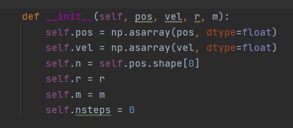
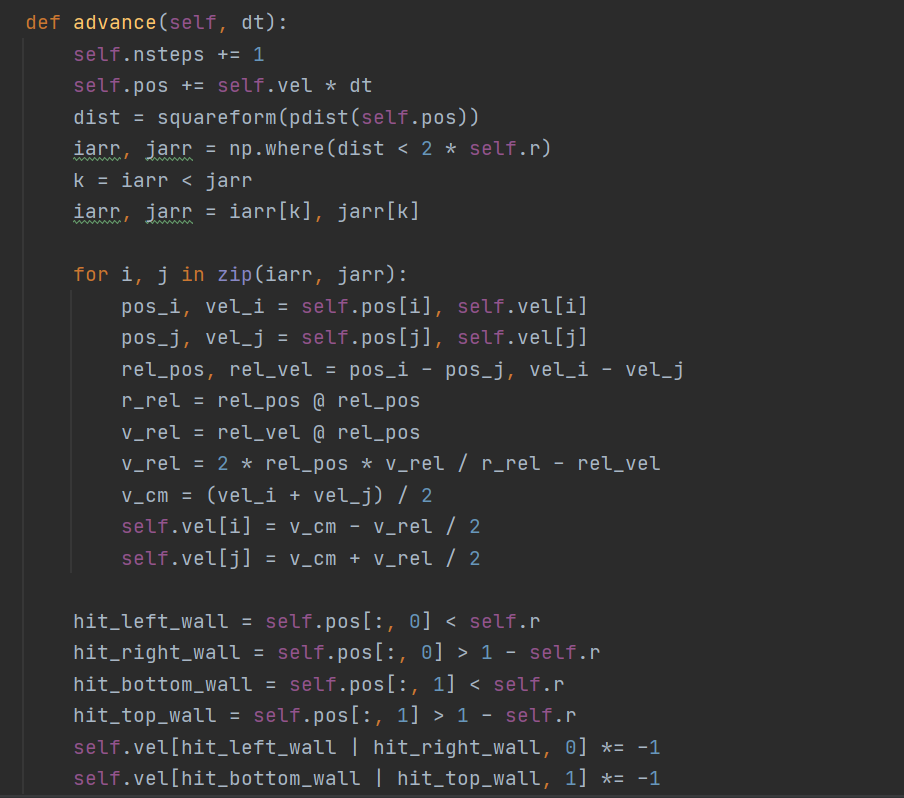
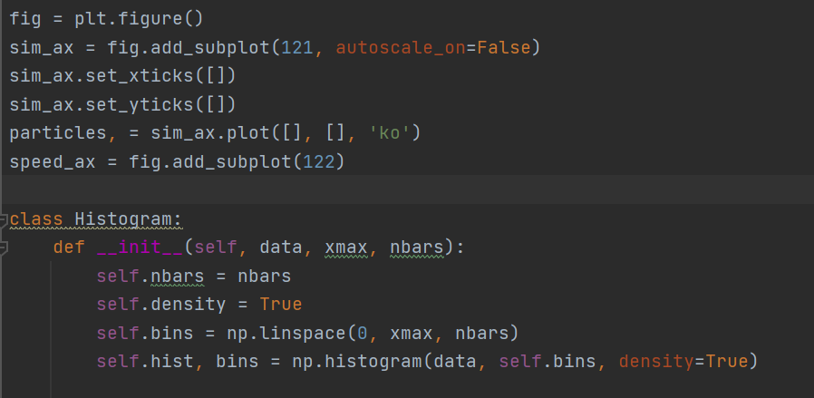
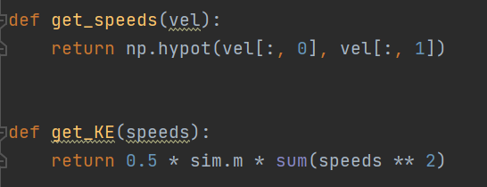

---
# Front matter
lang: ru-RU
title: Молекулярная динамика
subtitle: Этап 3
author: |
	Асеинова Е.В.; 
    Бармина О.К.;
	Горбунова Я.М.;
	Евсеева Д.О.;
	Исаханян Э.Т.
group: NFIbd-01-19
institute: RUDN University, Moscow, Russian Federation
date: 2022 March 10th

# Formatting
toc: false
slide_level: 2
header-includes: 
 - \metroset{progressbar=frametitle,sectionpage=progressbar,numbering=fraction}
 - '\makeatletter'
 - '\beamer@ignorenonframefalse'
 - '\makeatother'
aspectratio: 43
section-titles: true
theme: metropolis

---

## Введение

На предыдущих этапах нами была описана задача проекта, определены основные формулы, а также выведен алгоритм для написания программы. На данном этапе мы опишем программную реализацию нашего проекта.

## Класс MDSimulation

В программе описан класс, который задаёт все частицы в данной симуляции. 

## Функция advance

Внутри класса описана функция, которая определяет состояние симуляции в следующий момент времени.

{width=60%}

## Начальные условия

## Создание графиков

## Дополнительные функции 

Введём дополнительные функции для рассчёта скоростей частиц и их кинетической энергии

{width=60%}

## Распределение Максвелла

{width=60%}

## Результат работы

## Выводы

Наша задача заключалась в написании программы двумерной молекулярной динамики.

По итогу:

- написана программа двумерной молекулярной динамики для аргона

- построена гистограмма распределения частиц по скоростям
