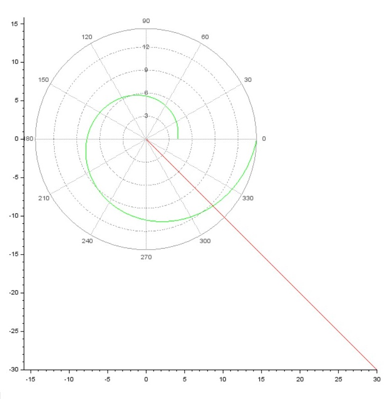
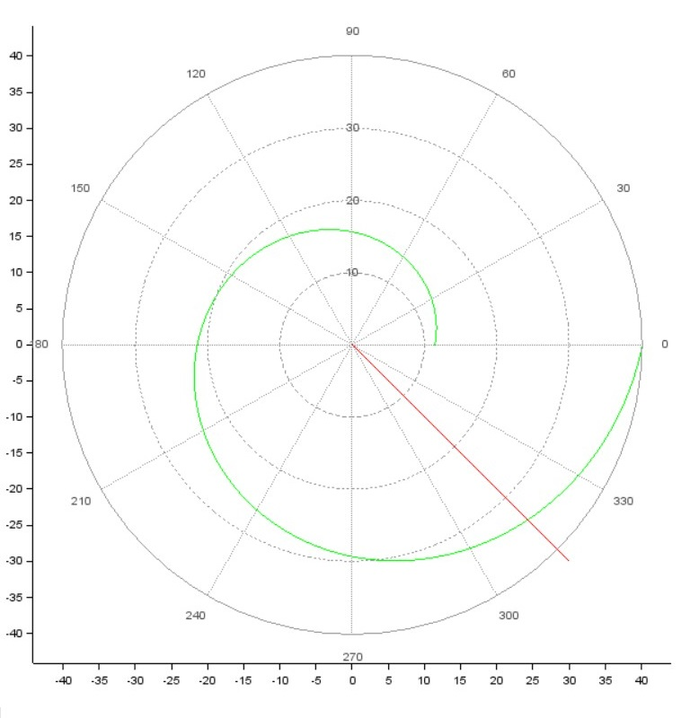

---
# Front matter
lang: ru-RU
title: Защита лабораторной работы №1. Задача о погоне
author: "Бармина Ольга Константиновна"
group: NFIbd-01-19
institute: RUDN University, Moscow, Russian Federation
date: 2022 Feb 15th

# Formatting
toc: false
slide_level: 2
header-includes: 
 - \metroset{progressbar=frametitle,sectionpage=progressbar,numbering=fraction}
 - '\makeatletter'
 - '\beamer@ignorenonframefalse'
 - '\makeatother'
aspectratio: 43
section-titles: true
theme: metropolis

---

# Результат выполнения лабораторной работы №2

# Цель выполнения лабораторной работы 

Построение математической модели для решения задачи о погоне на примере задачи приследование браконьеров береговой охраной.

# Задачи выполнения лабораторной работы

1. Провести рассуждения и вывод дифференциальных уравнений;

2. Построить траекторию движения катера и лодки для двух случаев;

3. Определить по графику точку пересечения катера и лодки.

# Уравнения

Основное уравнение:

$$ \frac{dr}{d\theta} = \frac{r}{\sqrt(25.01)} $$

Начальные условия: 

$ \left\{ 
\begin{array}{c}
\theta = 0 \\ 
r = \frac{10k}{61} \\ 
\end{array}
\right.$

или 

$ \left\{ 
\begin{array}{c}
\theta = -\pi \\ 
r = \frac{10k}{41} \\
\end{array}
\right.$

# Результат выполнения лабораторной работы

# Результат выполнения лабораторной работы

# Выводы

- построили математическую модель для решения задачи о погоне на примере задачи приследование браконьеров береговой охраной;

- вывели дифференциальные уравнения для решения данной задачи;

- построили график и определили точку пересечения траекторий.