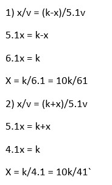
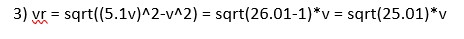
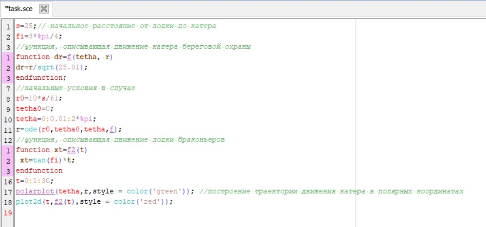
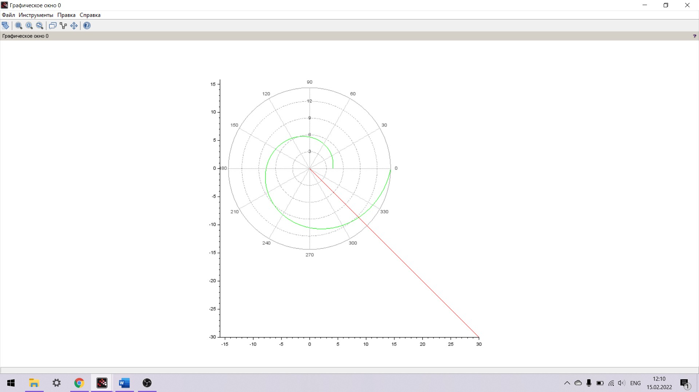
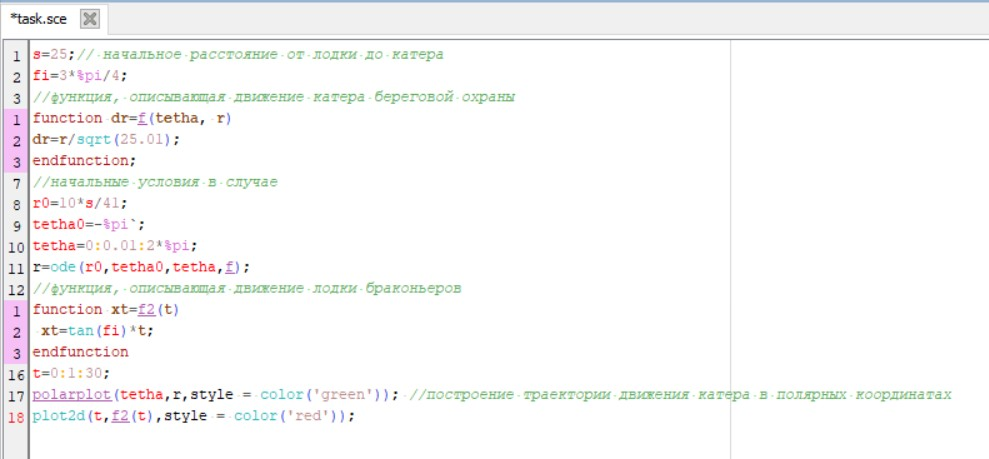
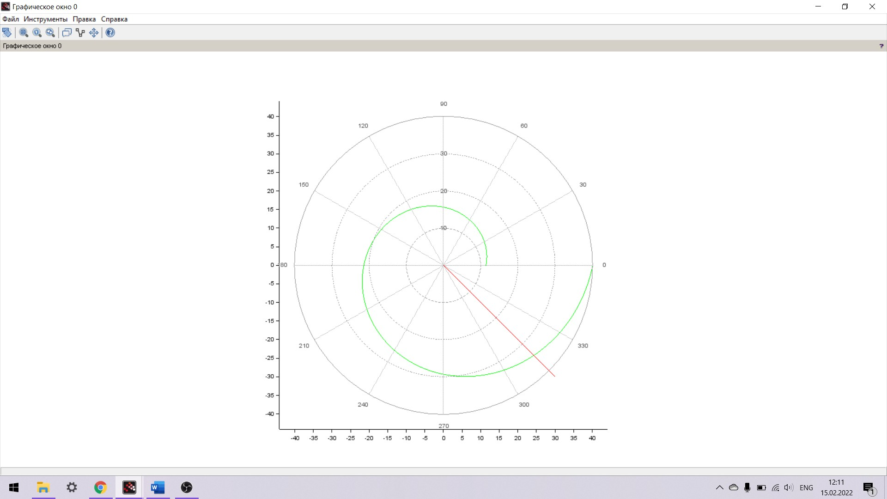

---
# Front matter
title: "Отчет по лабораторной работе №2"
subtitle: "Задача о погоне"
author: "Бармина Ольга Константиновна"
group: NFIbd-01-19
institute: RUDN University, Moscow, Russian Federation
date: 2022 Feb 15th

# Generic otions
lang: ru-RU
toc-title: "Содержание"

# Bibliography
csl: pandoc/csl/gost-r-7-0-5-2008-numeric.csl

# Pdf output format
toc: true # Table of contents
toc_depth: 2
lof: true # List of figures
lot: true # List of tables
fontsize: 12pt
linestretch: 1.5
papersize: a4
documentclass: scrreprt
### Fonts
mainfont: PT Serif
romanfont: PT Serif
sansfont: PT Sans
monofont: PT Mono
mainfontoptions: Ligatures=TeX
romanfontoptions: Ligatures=TeX
sansfontoptions: Ligatures=TeX,Scale=MatchLowercase
monofontoptions: Scale=MatchLowercase,Scale=0.9
## Biblatex
biblatex: true
biblio-style: "gost-numeric"
biblatexoptions:
  - parentracker=true
  - backend=biber
  - hyperref=auto
  - language=auto
  - autolang=other*
  - citestyle=gost-numeric
## Misc options
indent: true
header-includes:
  - \linepenalty=10 # the penalty added to the badness of each line within a paragraph (no associated penalty node) Increasing the value makes tex try to have fewer lines in the paragraph.
  - \interlinepenalty=0 # value of the penalty (node) added after each line of a paragraph.
  - \hyphenpenalty=50 # the penalty for line breaking at an automatically inserted hyphen
  - \exhyphenpenalty=50 # the penalty for line breaking at an explicit hyphen
  - \binoppenalty=700 # the penalty for breaking a line at a binary operator
  - \relpenalty=500 # the penalty for breaking a line at a relation
  - \clubpenalty=150 # extra penalty for breaking after first line of a paragraph
  - \widowpenalty=150 # extra penalty for breaking before last line of a paragraph
  - \displaywidowpenalty=50 # extra penalty for breaking before last line before a display math
  - \brokenpenalty=100 # extra penalty for page breaking after a hyphenated line
  - \predisplaypenalty=10000 # penalty for breaking before a display
  - \postdisplaypenalty=0 # penalty for breaking after a display
  - \floatingpenalty = 20000 # penalty for splitting an insertion (can only be split footnote in standard LaTeX)
  - \raggedbottom # or \flushbottom
  - \usepackage{float} # keep figures where there are in the text
  - \floatplacement{figure}{H} # keep figures where there are in the text
---

# Цель работы

Целью данной работы является построение математической модели для решения задачи о погоне на примере задачи приследование браконьеров береговой охраной.

# Задание

В ходе работы необходимо:

1. Провести рассуждения и вывод дифференциальных уравнений, если скорость катера больше скорости лодки в 5.1 раз и расстояние между ними составляет 25 км;

2. Построить траекторию движения катера и лодки для двух случаев;

3. Определить по графику точку пересечения катера и лодки.

# Теоретическое введение

Постановка задачи следующая:

На море в тумане катер береговой охраны преследует лодку браконьеров. Через определенный промежуток времени туман рассеивается, и лодка обнаруживается на расстоянии 25 км от катера. Затем лодка снова скрывается в тумане и уходит прямолинейно в неизвестном направлении. Известно, что скорость катера в 5,1 раза больше скорости браконьерской лодки.

Решение исходной задачи сводится к решению системы из двух дифференциальных уравнений 

$$ \left\{ 
\begin{array}{c}
\frac{dt}{dt} = v \\ 
r\frac{d\theta}{dt} = \sqrt(25.01)v \\ 
\end{array}
\right. \tag{Основная система для решения задачи}$$

с начальными условиями 

$$ \left\{ 
\begin{array}{c}
\theta = 0 \\ 
r = \frac{10k}{61} \\ 
\end{array}
\right. \tag{Начальные условия 1}$$

или 

$$ \left\{ 
\begin{array}{c}
\theta = -\pi \\ 
r = \frac{10k}{41} \\
\end{array}
\right. \tag{Начальные условия 2}$$

# Выполнение лабораторной работы

1. Принимает за $ t_0 = 0 $, $ x_{л0} = 0 $ место нахождения лодки браконьеров в момент обнаружения, $ x_{k0} = 25 $ - место нахождения катера береговой охраны относительно лодки браконьеров в момент обнаружения лодки.

2. Введем полярные координаты. Считаем, что полюс - это точка обнаружения лодки браконьеров, а полярная ось проходит через точку нахождения катера береговой охраны.

3. Чтобы найти расстояние x (расстояние после которого катер начнет двигаться вокруг полюса), необходимо составить уравнение. Пусть через время t катер и лодка окажутся на одном расстоянии от полюса. За это время лодка пройдет x, а катер k - x (или k + x, в зависимости от начального положения катера относительно полюса). Время, за которое они пройдут это расстояние, вычисляется как x/v или (k - x)/ 5.1v (во втором случаеx (k + x)/ 5.1v). Тогда неизвестное расстояние можно найти из следующего уравнения:
$ \left\{ 
\begin{array}{c}
\theta = 0 \\ 
r = \frac{10k}{61} \\ 
\end{array}
\right.$ в первом случае или
$ \left\{ 
\begin{array}{c}
\theta = -\pi \\ 
r = \frac{10k}{41} \\
\end{array}
\right.$ во втором. Отсюда мы найдем два значения $ x_1 = \frac{10k}{61} $ и $ x_1 = \frac{10k}{41} $, задачу будем решать для двух случаев

4. После того, как катер береговой охраны окажется на одном расстоянии от полюса, что и лодка, он должен сменить прямолинейную траекторию и начать двигаться вокруг полюса удаляясь от него со скоростью лодки v. Для этого скорость катера раскладываем на две составляющие: $v_r$ - радиальная скорость и $v_\tau$ - тангенциальная скорость. Радиальная скорость - это скорость, с которой катер удаляется от полюса. Нам нужно, чтобы эта скорость была равна скорости лодки, поэтому полагаем $v_r = \frac{dr}{dt}$. 
Тангенциальная скорость – это линейная скорость вращения катера относительно полюса. Она равна произведению угловой скорости на радиус: $v_\tau = r\frac{d\theta}{dt}$. По теореме пифагора получаем, что $r\frac{d\theta}{dt} = \sqrt(25.01)v$.

5. Решение исходной задачи сводится к решению системы из двух
дифференциальных уравнений с двумя начальными условиями. Исключая из полученной системы производную по t, можно перейти к
следующему уравнению:

$$ \frac{dr}{d\theta} = \frac{r}{\sqrt(25.01)} \tag{Уравнение траектории движения катера}$$

Решив это уравнение, можно получить траекторию движения катера в полярных координатах.

6. Перейдем к написанию программы в SciLab. Установим начальное растояние s = 25, в функции dr укажем нашу формулу, изменяя консанту на 25.01, установим r0 и tetha как в первой системе начальных условий.

В результате получаем следующий график:

По графику видно, что траектории лодки и катера пересекутся на растоянии 8.7 км.

7. Перейдем ко вторым начальным условиям. Для этого установим r0 и tetha как во второй системе начальных условий.

В результате получаем следующий график:

По графику видно, что траектории лодки и катера пересекутся на растоянии 24.3 км.

# Выводы

В ходе работы мы построили математическую модель для решения задачи о погоне на примере задачи приследование браконьеров береговой охраной. Мы вывели дифференциальные уравнения для решения данной задачи, построили график и определили точку пересечения траекторий.

# Список литературы

1. Методические материалы курса

2. Wikipedia: Кривая погони (https://ru.wikipedia.org/wiki/%D0%9A%D1%80%D0%B8%D0%B2%D0%B0%D1%8F_%D0%BF%D0%BE%D0%B3%D0%BE%D0%BD%D0%B8)