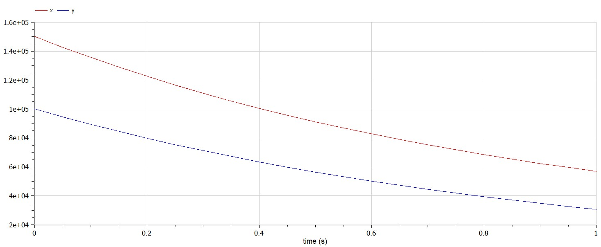
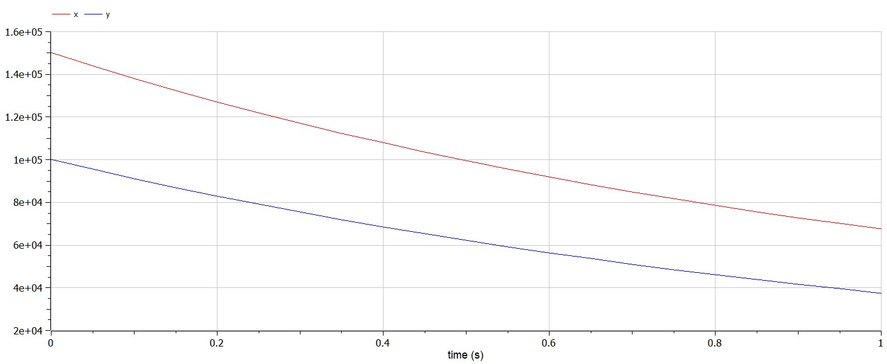

---
# Front matter
lang: ru-RU
title: Защита лабораторной работы №3. Модель боевых действий
author: "Бармина Ольга Константиновна"
group: NFIbd-01-19
institute: RUDN University, Moscow, Russian Federation
date: 2022 Feb 22th

# Formatting
toc: false
slide_level: 2
header-includes: 
 - \metroset{progressbar=frametitle,sectionpage=progressbar,numbering=fraction}
 - '\makeatletter'
 - '\beamer@ignorenonframefalse'
 - '\makeatother'
aspectratio: 43
section-titles: true
theme: metropolis

---

# Результат выполнения лабораторной работы №3

# Цель выполнения лабораторной работы 

Построение математической модели боевых действий с помощью OpenModelica.

# Задачи выполнения лабораторной работы

1. Рассмотреть 3 модели боя:

    - Модель боевых действий между регулярными войсками

    - Модель ведение боевых действий с участием регулярных войск и партизанских отрядов

    - Модель боевых действий между партизанскими отрядами

2. Построить графики y(t) и x(t)

3. Найти условие, при котором та или другая сторона выигрывают бой (для каждого случая).

# Уравнения

Модель боевых действий между регулярными войсками:

$$\frac{dx}{dt} = -a(t)x(t) - b(t)y(t) + P(t)$$

$$\frac{dy}{dt} = -c(t)x(t) - h(t)y(t) + Q(t)$$

Модель ведение боевых действий с участием регулярных войск и партизанских отрядов:

$$\frac{dx}{dt} = -a(t)x(t) - b(t)y(t) + P(t)$$

$$\frac{dy}{dt} = -c(t)x(t)y(t) - h(t)y(t) + Q(t)$$

# Коэффициенты

Вариант 34:

x0 = 150000
y0 = 100000

1. a = 0.45
b = 0.85
c = 0.45
h = 0.45
p(t) = sin(t+8)+1
Q(t) = cos(t+8)+1

2. a = 0.31
b = 0.79
c = 0.41
h = 0.32
p(t) = 2sin(t)
Q(t) = 2cos(t)

# Результат выполнения лабораторной работы

# Результат выполнения лабораторной работы

# Выводы

1. Рассмотрели 3 модели боя

2. Построили графики y(t) и x(t)

3. Найшли условие, при котором та или другая сторона выигрывают бой