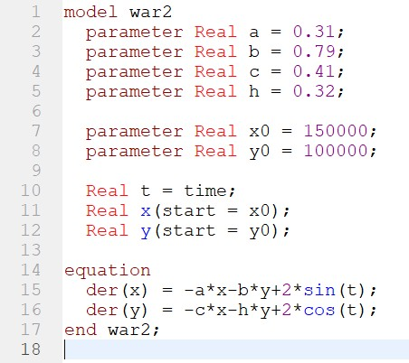
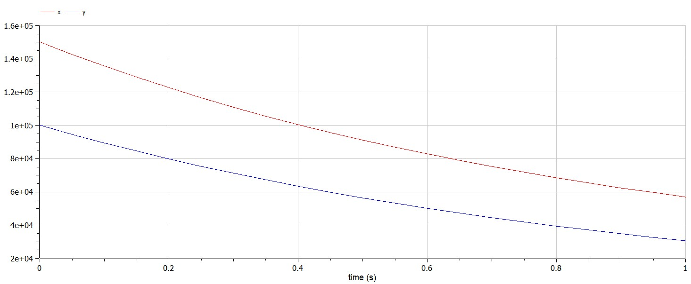
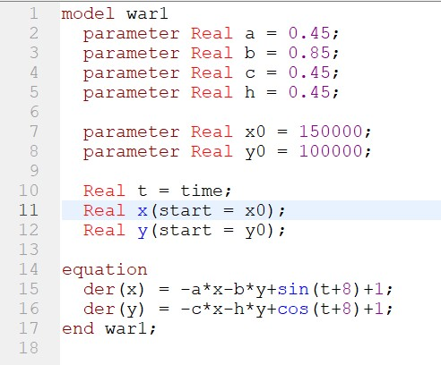
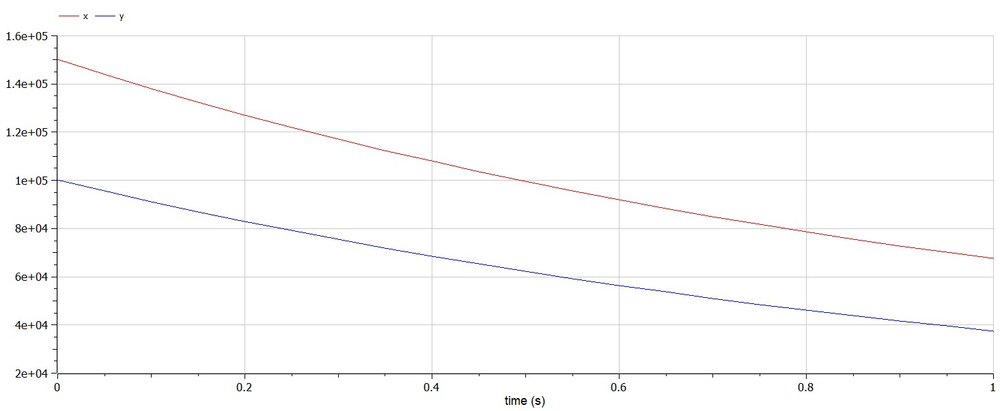

---
# Front matter
title: "Отчет по лабораторной работе №3"
subtitle: "Модель боевых действий. Вариант 34"
author: "Бармина Ольга Константиновна"
group: NFIbd-01-19
institute: RUDN University, Moscow, Russian Federation
date: 2022 Feb 22th

# Generic otions
lang: ru-RU
toc-title: "Содержание"

# Bibliography
csl: pandoc/csl/gost-r-7-0-5-2008-numeric.csl

# Pdf output format
toc: true # Table of contents
toc_depth: 2
lof: true # List of figures
lot: true # List of tables
fontsize: 12pt
linestretch: 1.5
papersize: a4
documentclass: scrreprt
### Fonts
mainfont: PT Serif
romanfont: PT Serif
sansfont: PT Sans
monofont: PT Mono
mainfontoptions: Ligatures=TeX
romanfontoptions: Ligatures=TeX
sansfontoptions: Ligatures=TeX,Scale=MatchLowercase
monofontoptions: Scale=MatchLowercase,Scale=0.9
## Biblatex
biblatex: true
biblio-style: "gost-numeric"
biblatexoptions:
  - parentracker=true
  - backend=biber
  - hyperref=auto
  - language=auto
  - autolang=other*
  - citestyle=gost-numeric
## Misc options
indent: true
header-includes:
  - \linepenalty=10 # the penalty added to the badness of each line within a paragraph (no associated penalty node) Increasing the value makes tex try to have fewer lines in the paragraph.
  - \interlinepenalty=0 # value of the penalty (node) added after each line of a paragraph.
  - \hyphenpenalty=50 # the penalty for line breaking at an automatically inserted hyphen
  - \exhyphenpenalty=50 # the penalty for line breaking at an explicit hyphen
  - \binoppenalty=700 # the penalty for breaking a line at a binary operator
  - \relpenalty=500 # the penalty for breaking a line at a relation
  - \clubpenalty=150 # extra penalty for breaking after first line of a paragraph
  - \widowpenalty=150 # extra penalty for breaking before last line of a paragraph
  - \displaywidowpenalty=50 # extra penalty for breaking before last line before a display math
  - \brokenpenalty=100 # extra penalty for page breaking after a hyphenated line
  - \predisplaypenalty=10000 # penalty for breaking before a display
  - \postdisplaypenalty=0 # penalty for breaking after a display
  - \floatingpenalty = 20000 # penalty for splitting an insertion (can only be split footnote in standard LaTeX)
  - \raggedbottom # or \flushbottom
  - \usepackage{float} # keep figures where there are in the text
  - \floatplacement{figure}{H} # keep figures where there are in the text
---

# Цель работы

Целью данной работы является построение математической модели боевых действий с помощью OpenModelica.

# Задание

В ходе работы необходимо:

1. Рассмотреть 3 модели боя:

    1. Модель боевых действий между регулярными войсками

    2. Модель ведение боевых действий с участием регулярных войск и партизанских отрядов

    3. Модель боевых действий между партизанскими отрядами

2. Построить графики y(t) и x(t)

3. Найти условие, при котором та или другая сторона выигрывают бой (для каждого случая).

# Теоретическое введение

Моделирование боевых и военных действий является важнейшей научной и практической задачей, направленной на предоставление командованию количественных оснований для принятия решений.

Первые модели боя были разработаны в годы первой мировой войны, а в настоящее время они получили широкое распространение в связи с массовым внедрением средств автоматизации. Вместе с тем в моделях боя и войны не в полной мере учитывается моральный потенциал участников конфликта, что побуждает и мотивирует дальнейшее развитие моделей боя и войны. [1]

В первом случае численность регулярных войск определяется тремя факторами:

- скорость уменьшения численности войск из-за причин, не связанных с боевыми действиями (болезни, травмы, дезертирство);

- скорость потерь, обусловленных боевыми действиями противоборствующих сторон (что связанно с качеством стратегии, уровнем вооружения, профессионализмом солдат и т.п.);

- скорость поступления подкрепления (задаётся некоторой функцией от времени). [2]

В этом случае модель боевых действий между регулярными войсками описывается следующим образом: 

$$\frac{dx}{dt} = -a(t)x(t) - b(t)y(t) + P(t)$$

$$\frac{dy}{dt} = -c(t)x(t) - h(t)y(t) + Q(t)$$

Потери, не связанные с боевыми действиями, описывают члены $-a(t)x(t)$ и $-h(t)y(t)$, члены $-b(t)y(t)$ и $-c(t)x(t)$ отражают потери на поле боя.Коэффициенты $b(t)$ и $c(t)$ указывают на эффективность боевых действий со стороны у и х соответственно, $a(t)$ и $h(t)$ - величины, характеризующие степень влияния различных факторов на потери. Функции $P(t)$, $Q(t)$ учитывают возможность подхода подкрепления к войскам Х и У в течение одного дня.

Во втором случае в борьбу добавляются партизанские отряды. Нерегулярные войска в отличии от постоянной армии менее уязвимы, так как действуют скрытно, в этом случае сопернику приходится действовать неизбирательно, по площадям, занимаемым партизанами. Поэтому считается, что тем потерь партизан, проводящих свои операции в разных местах на некоторой известной территории, пропорционален не только численности армейских соединений, но и численности самих партизан. В результате модель принимает вид:

$$\frac{dx}{dt} = -a(t)x(t) - b(t)y(t) + P(t)$$

$$\frac{dy}{dt} = -c(t)x(t)y(t) - h(t)y(t) + Q(t)$$

Модель ведение боевых действий между партизанскими отрядами с учетом предположений, сделанном в предыдущем случаем, имеет вид:

$$\frac{dx}{dt} = -a(t)x(t) - b(t)x(t)y(t) + P(t)$$

$$\frac{dy}{dt} = -c(t)x(t)y(t) - h(t)y(t) + Q(t)$$

# Выполнение лабораторной работы

1. Напишем программу для построения модели боевых действий между регулярными войсками, используя вышеприведеннные уравнения. Используем OpenModelica.

2. Совершим симуляцию результатов в период от 0 до 1 с шагом 0.5. Выведем графики для x и y на экран. 

3. Изменим программу для построения модели ведение боевых действий с участием регулярных войск и партизанских отрядов, корректируя коэффициенты уравнений.

4. Совершим симуляцию результатов в период от 0 до 1 с шагом 0.5. Выведем графики для x и y на экран. 

# Выводы

В ходе работы мы рассмотрели 3 модели боя: модель боевых действий между регулярными войсками, модель ведение боевых действий с участием регулярных войск и партизанских отрядов и модель боевых действий между партизанскими отрядами. Мы построили графики y(t) и x(t) и нашли условие, при котором та или другая сторона выигрывают бой.

# Список литературы

1. В.В. Шумов, В.О. Корепанов "КОМПЬЮТЕРНЫЕ ИССЛЕДОВАНИЯ И МОДЕЛИРОВАНИЕ", 2020 Т.12 №1 С.217–242 (http://www.crm.ics.org.ru/uploads/crmissues/crm_2020_1/2020_01_14.pdf)

2. Методические материалы курса
