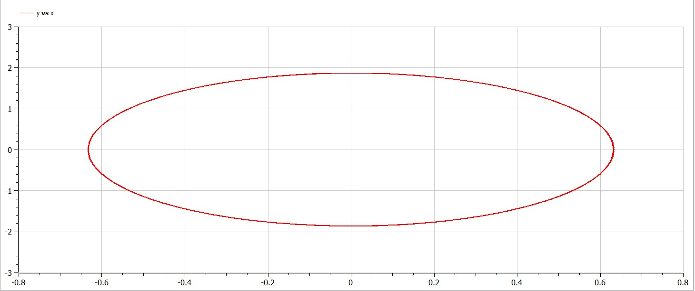
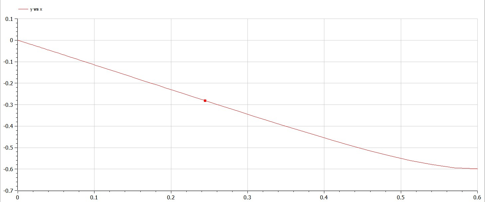
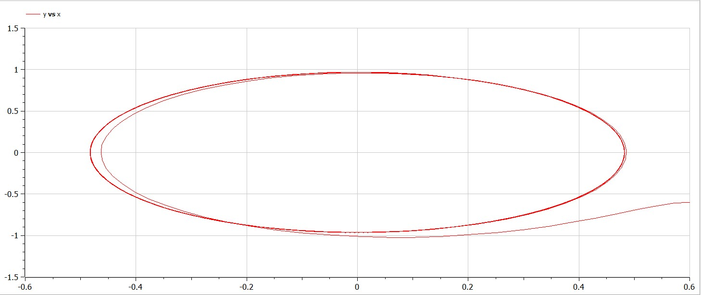

---
# Front matter
lang: ru-RU
title: Защита лабораторной работы №4. Модель гармонических колебаний 
author: "Бармина Ольга Константиновна"
group: NFIbd-01-19
institute: RUDN University, Moscow, Russian Federation
date: 2022 March 1st

# Formatting
toc: false
slide_level: 2
header-includes: 
 - \metroset{progressbar=frametitle,sectionpage=progressbar,numbering=fraction}
 - '\makeatletter'
 - '\beamer@ignorenonframefalse'
 - '\makeatother'
aspectratio: 43
section-titles: true
theme: metropolis

---

# Результат выполнения лабораторной работы №3

# Цель выполнения лабораторной работы 

Построение математической модели гармонических колебаний с помощью OpenModelica.

# Задачи выполнения лабораторной работы

1. Построить  решение  уравнения гармонического  осциллятора  без  затухания.

2. Записать уравнение свободных колебаний гармонического осциллятора с затуханием, построить его решение. Построить фазовый портрет гармонических колебаний с затуханием.

3. Записать уравнение колебаний гармонического осциллятора, если на систему действует внешняя сила, построить его решение. Построить фазовый портрет колебаний с действием внешней силы. 

4. Записать простейшую модель гармонических колебаний, дать определение осциллятора, записать модель математического маятника и алгоритм перехода от дифференциального уравнения второго порядка к двум дифференциальным уравнениям первого порядка, объяснить, что такое фазовый портрет и фазовая траектория.

# Определения

Гармонические колебания — колебания, при которых физическая величина изменяется с течением времени по гармоническому (синусоидальному, косинусоидальному) закону. [2]

Осциллятор — система, совершающая колебания, то есть показатели которой периодически повторяются во времени.

Фазовый портрет гармонического осциллятора представляет собой семейство эллипсов, каждому из которых соответствует энергия запасенная осциллятором.

Фазовая траектория - кривая в фазовом пространстве, составленная из точек, представляющих состояние динамической системы в последовательные моменты времени.

# Уравнения

Уравнение свободных колебаний гармонического осциллятора имеет следующий вид: 

$$x''+2\gamma x'+\omega ^2 x=0$$

# Коэффициенты

Вариант 34:

1. Колебания гармонического осциллятора без затуханий и без действий внешней силы $x''+8.7x=0$ 

2. Колебания гармонического осциллятора c затуханием и без действий внешней силы $x''+8.7x'+8.7x=0$ 

3. Колебания гармонического осциллятора c затуханием и под действием внешней силы $x''+8.7x'+8.7x=8.7sin(2t)$ 

На интервале [0; 67], шаг 0.05 с начальными условиями $x_0=0.6$ $y_0=-0.6$

# Результат выполнения лабораторной работы

# Результат выполнения лабораторной работы

# Результат выполнения лабораторной работы

# Выводы

1. Построили  решение  уравнения гармонического  осциллятора  без  затухания.

2. Записали уравнение свободных колебаний гармонического осциллятора с затуханием, построили его решение. 

3. Построили фазовый портрет гармонических колебаний с затуханием.

4. Записали уравнение колебаний гармонического осциллятора, если на систему действует внешняя сила, построили его решение. 

5. Построили фазовый портрет колебаний с действием внешней силы. 