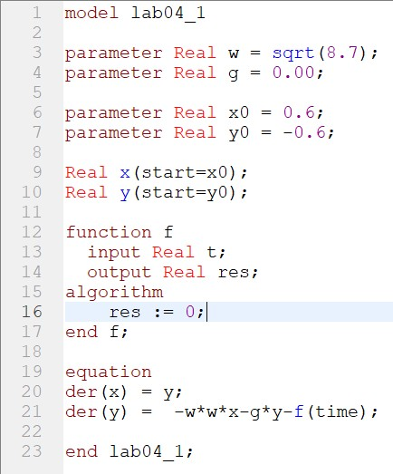

---
# Front matter
title: "Отчет по лабораторной работе №4"
subtitle: "Модель гармонических колебаний . Вариант 34"
author: "Бармина Ольга Константиновна"
group: NFIbd-01-19
institute: RUDN University, Moscow, Russian Federation
date: 2022 March 1st

# Generic otions
lang: ru-RU
toc-title: "Содержание"

# Pdf output format
toc: true # Table of contents
toc_depth: 2
lof: true # List of figures
lot: true # List of tables
fontsize: 12pt
linestretch: 1.5
papersize: a4
documentclass: scrreprt
### Fonts
mainfont: PT Serif
romanfont: PT Serif
sansfont: PT Sans
monofont: PT Mono
mainfontoptions: Ligatures=TeX
romanfontoptions: Ligatures=TeX
sansfontoptions: Ligatures=TeX,Scale=MatchLowercase
monofontoptions: Scale=MatchLowercase,Scale=0.9
## Biblatex
biblatex: true
biblio-style: "gost-numeric"
biblatexoptions:
  - parentracker=true
  - backend=biber
  - hyperref=auto
  - language=auto
  - autolang=other*
  - citestyle=gost-numeric
## Misc options
indent: true
header-includes:
  - \linepenalty=10 # the penalty added to the badness of each line within a paragraph (no associated penalty node) Increasing the value makes tex try to have fewer lines in the paragraph.
  - \interlinepenalty=0 # value of the penalty (node) added after each line of a paragraph.
  - \hyphenpenalty=50 # the penalty for line breaking at an automatically inserted hyphen
  - \exhyphenpenalty=50 # the penalty for line breaking at an explicit hyphen
  - \binoppenalty=700 # the penalty for breaking a line at a binary operator
  - \relpenalty=500 # the penalty for breaking a line at a relation
  - \clubpenalty=150 # extra penalty for breaking after first line of a paragraph
  - \widowpenalty=150 # extra penalty for breaking before last line of a paragraph
  - \displaywidowpenalty=50 # extra penalty for breaking before last line before a display math
  - \brokenpenalty=100 # extra penalty for page breaking after a hyphenated line
  - \predisplaypenalty=10000 # penalty for breaking before a display
  - \postdisplaypenalty=0 # penalty for breaking after a display
  - \floatingpenalty = 20000 # penalty for splitting an insertion (can only be split footnote in standard LaTeX)
  - \raggedbottom # or \flushbottom
  - \usepackage{float} # keep figures where there are in the text
  - \floatplacement{figure}{H} # keep figures where there are in the text
---

# Цель работы

Целью данной работы является построение математической модели гармонических колебаний с помощью OpenModelica.

# Задание

В ходе работы необходимо:

1. Построить  решение  уравнения гармонического  осциллятора  без  затухания.

2. Записать уравнение свободных колебаний гармонического осциллятора с затуханием, построить его решение. Построить фазовый портрет гармонических колебаний с затуханием.

3. Записать уравнение колебаний гармонического осциллятора, если на систему действует внешняя сила, построить его решение. Построить фазовый портрет колебаний с действием внешней силы. 

4. Записать простейшую модель гармонических колебаний, дать определение осциллятора, записать модель математического маятника и алгоритм перехода от дифференциального уравнения второго порядка к двум дифференциальным уравнениям первого порядка, объяснить, что такое фазовый портрет и фазовая траектория. [1]

# Теоретическое введение

Гармонические колебания — колебания, при которых физическая величина изменяется с течением времени по гармоническому (синусоидальному, косинусоидальному) закону. [2]

Осциллятор — система, совершающая колебания, то есть показатели которой периодически повторяются во времени.

Уравнение свободных колебаний гармонического осциллятора имеет следующий вид: 

$$x''+2\gamma x'+\omega ^2 x=0$$

где x – переменная, описывающая состояние системы, $\gamma$ – параметр, характеризующий потери энергии, $\omega$ – собственная частота колебаний, t – время.

Данное уравнение есть линейное однородное дифференциальное уравнение второго порядка и оно является примером линейной динамической системы. При отсутствии потерь в системе вместо этого уравнения получаем уравнение консервативного осциллятора энергия колебания которого сохраняется во времени. 

$$x''+\omega ^2_0 x=0$$

Для однозначной разрешимости уравнения второго порядка (2) необходимо задать два начальных условия вида 

$$ \left\{ 
\begin{array}{c}
x(t_0)=x_0 \\ 
x'(t_0)=y_0 \\ 
\end{array}
\right.$$

Уравнение второго порядка можно представить в виде системы двух уравнений первого порядка:  

$$ \left\{ 
\begin{array}{c}
x'=y \\ 
y'=-\omega ^2_0 x \\ 
\end{array}
\right.$$

Начальные условия примут вид: 

$$ \left\{ 
\begin{array}{c}
x(t_0)=x_0 \\ 
y(t_0)=y_0 \\ 
\end{array}
\right.$$

Независимые переменные x, y определяют пространство, в котором «движется» решение. Это фазовое пространство системы, поскольку оно двумерно будем называть его фазовой плоскостью. 

Значение фазовых координат x, y в любой момент времени полностью определяет состояние системы. Решению уравнения движения как функции времени отвечает гладкая кривая в фазовой плоскости. Она называется фазовой траекторией. Если множество различных решений изобразить на одной фазовой плоскости, возникает общая картина поведения системы. Такую картину, образованную набором фазовых траекторий, называют фазовым портретом. 

# Выполнение лабораторной работы

1. Напишем программу для построения решениz уравнения гармонического  осциллятора  без  затухания.

2. Совершим симуляцию результатов в период от 0 до 67 с шагом 0.05. Выведем параметрический график по х на экран. 

3. Изменим программу для уравнения свободных колебаний гармонического осциллятора с затуханием.

4. Совершим симуляцию результатов в период от 0 до 67 с шагом 0.05. Выведем параметрический график по х на экран. 

5. Изменим программу для уравнения колебаний гармонического осциллятора, если на систему действует внешняя сила

6. Совершим симуляцию результатов в период от 0 до 67 с шагом 0.05. Выведем параметрический график по х на экран. 

# Выводы

В ходе работы мы построили решение уравнения гармонического осциллятора без затухания, записали уравнение свободных колебаний гармонического осциллятора с затуханием, построили его решение, построили фазовый портрет гармонических колебаний с затуханием, и записали уравнение колебаний гармонического осциллятора, если на систему действует внешняя сила, построили его решение, построили фазовый портрет колебаний с действием внешней силы. 

# Список литературы

1. Методические материалы курса

2. Википедия: Гармонические колебания (https://ru.wikipedia.org/wiki/%D0%93%D0%B0%D1%80%D0%BC%D0%BE%D0%BD%D0%B8%D1%87%D0%B5%D1%81%D0%BA%D0%B8%D0%B5_%D0%BA%D0%BE%D0%BB%D0%B5%D0%B1%D0%B0%D0%BD%D0%B8%D1%8F)
