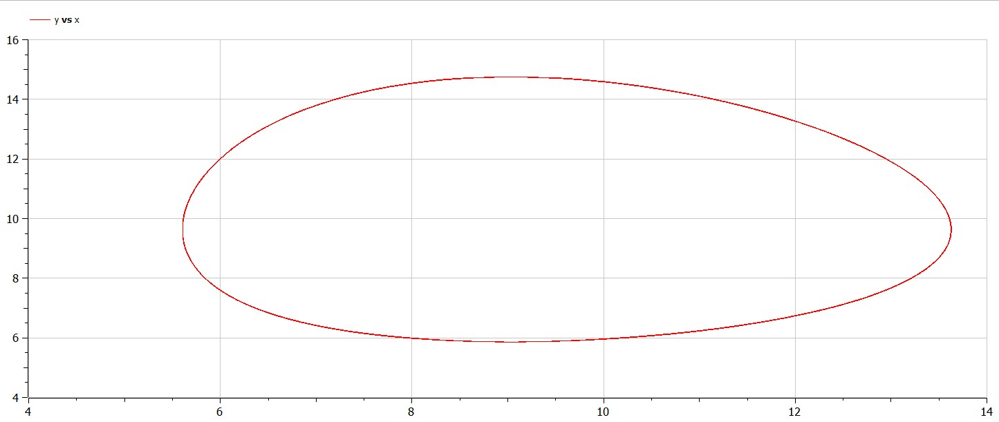
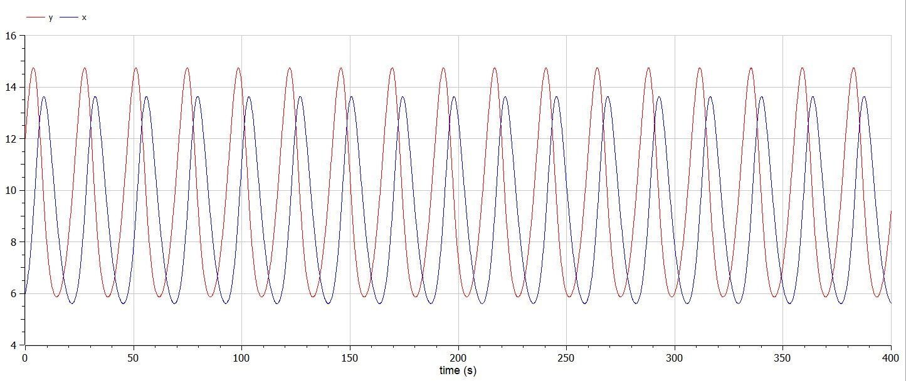
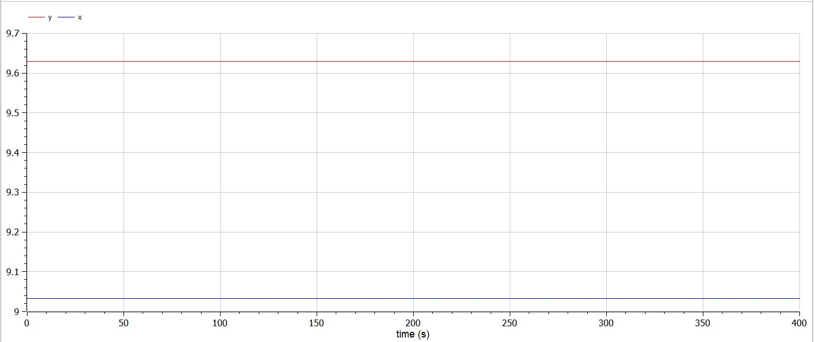

---
# Front matter
lang: ru-RU
title: Защита лабораторной работы №5. Модель хищник-жертва
author: "Бармина Ольга Константиновна"
group: NFIbd-01-19
institute: RUDN University, Moscow, Russian Federation
date: 2022 March 8th

# Formatting
toc: false
slide_level: 2
header-includes: 
 - \metroset{progressbar=frametitle,sectionpage=progressbar,numbering=fraction}
 - '\makeatletter'
 - '\beamer@ignorenonframefalse'
 - '\makeatother'
aspectratio: 43
section-titles: true
theme: metropolis

---

# Результат выполнения лабораторной работы №5

# Цель выполнения лабораторной работы 

Ознакомление с простейшей моделью взаимодействия двух видов типа «хищник — жертва» - модель Лотки-Вольтерры и построение графиков на языке Modelica.

# Задачи выполнения лабораторной работы

1. Построить график зависимости x от y и графики функций x(t), y(t);  

2. Найти стационарное состояние системы.

# Определения

Простейшая модель взаимодействия двух видов типа «хищник — жертва» основывается на следующих предположениях:

1. Численность популяции жертв x и хищников y зависят только от времени (модель не учитывает пространственное распределение популяции на занимаемой территории).

2. В отсутствии взаимодействия численность видов изменяется по модели Мальтуса, при этом число жертв увеличивается, а число хищников падает.

3. Естественная смертность жертвы и естественная рождаемость хищника считаются несущественными.

4. Эффект насыщения численности обеих популяций не учитывается.

5. Скорость роста численности жертв уменьшается пропорционально численности хищников.

# Уравнения

$$\begin{cases} \frac{dx}{dt}=-ax(t)+bx(t)y(t) \\ \frac{dy}{dt}=cx(t)-dx(t)y(t) \end{cases} $$

В этой модели $x$ – число жертв, $y$ - число хищников. Коэффициент a - скорость естественного прироста числа жертв в отсутствие хищников, $с$ - естественное вымирание хищников, лишенных пищи в виде жертв.

# Коэффициенты

Вариант 34:

$$ \begin{cases} \frac{dx}{dt}=-0.26x(t)+0.027x(t)y(t) \\ \frac{dy}{dt}=0.28x(t)-0.031x(t)y(t) \end{cases} $$

Начальные условия $x_0=6, y_0=12$

# Результат выполнения лабораторной работы

# Результат выполнения лабораторной работы

# Результат выполнения лабораторной работы

# Выводы

1. Построили график зависимости x от y и графики функций x(t), y(t);  

2. Нашли стационарное состояние системы.