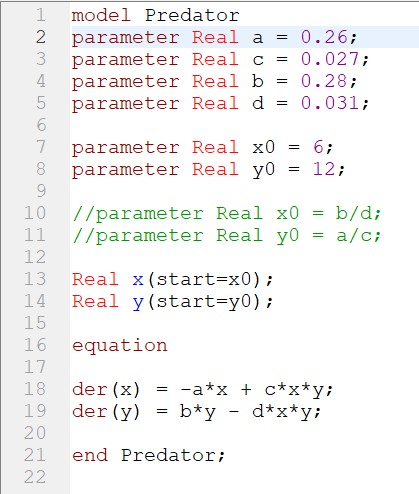
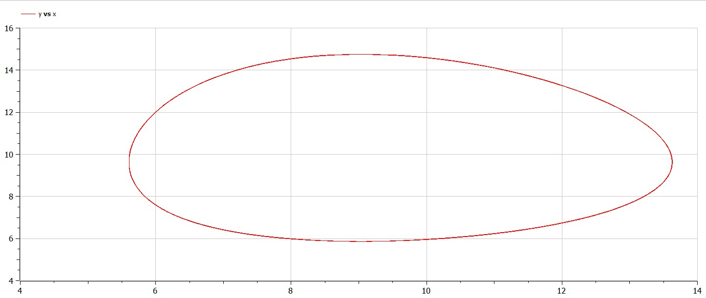
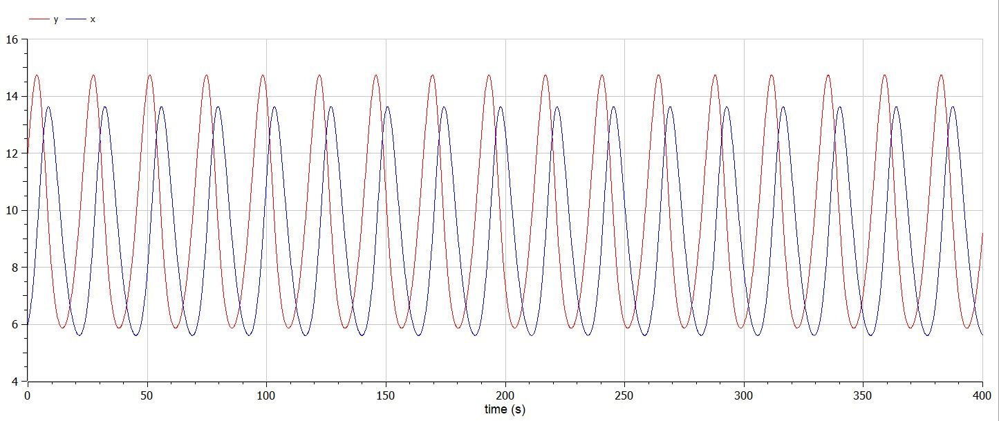
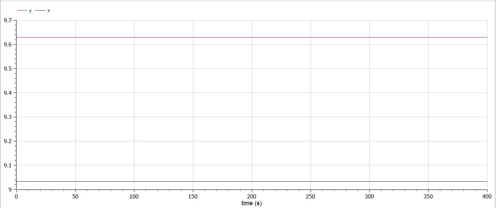

---
# Front matter
title: "Отчет по лабораторной работе №5"
subtitle: "Модель хищник-жертва. Вариант 34"
author: "Бармина Ольга Константиновна"
group: NFIbd-01-19
institute: RUDN University, Moscow, Russian Federation
date: 2022 March 8th

# Generic otions
lang: ru-RU
toc-title: "Содержание"

# Pdf output format
toc: true # Table of contents
toc_depth: 2
lof: true # List of figures
lot: true # List of tables
fontsize: 12pt
linestretch: 1.5
papersize: a4
documentclass: scrreprt
### Fonts
mainfont: PT Serif
romanfont: PT Serif
sansfont: PT Sans
monofont: PT Mono
mainfontoptions: Ligatures=TeX
romanfontoptions: Ligatures=TeX
sansfontoptions: Ligatures=TeX,Scale=MatchLowercase
monofontoptions: Scale=MatchLowercase,Scale=0.9
## Biblatex
biblatex: true
biblio-style: "gost-numeric"
biblatexoptions:
  - parentracker=true
  - backend=biber
  - hyperref=auto
  - language=auto
  - autolang=other*
  - citestyle=gost-numeric
## Misc options
indent: true
header-includes:
  - \linepenalty=10 # the penalty added to the badness of each line within a paragraph (no associated penalty node) Increasing the value makes tex try to have fewer lines in the paragraph.
  - \interlinepenalty=0 # value of the penalty (node) added after each line of a paragraph.
  - \hyphenpenalty=50 # the penalty for line breaking at an automatically inserted hyphen
  - \exhyphenpenalty=50 # the penalty for line breaking at an explicit hyphen
  - \binoppenalty=700 # the penalty for breaking a line at a binary operator
  - \relpenalty=500 # the penalty for breaking a line at a relation
  - \clubpenalty=150 # extra penalty for breaking after first line of a paragraph
  - \widowpenalty=150 # extra penalty for breaking before last line of a paragraph
  - \displaywidowpenalty=50 # extra penalty for breaking before last line before a display math
  - \brokenpenalty=100 # extra penalty for page breaking after a hyphenated line
  - \predisplaypenalty=10000 # penalty for breaking before a display
  - \postdisplaypenalty=0 # penalty for breaking after a display
  - \floatingpenalty = 20000 # penalty for splitting an insertion (can only be split footnote in standard LaTeX)
  - \raggedbottom # or \flushbottom
  - \usepackage{float} # keep figures where there are in the text
  - \floatplacement{figure}{H} # keep figures where there are in the text
---

# Цель работы

Ознакомление с простейшей моделью взаимодействия двух видов типа «хищник — жертва» - модель Лотки-Вольтерры и построение графиков на языке Modelica.

# Задачи

1. Построить график зависимости x от y и графики функций x(t), y(t);  

2. Найти стационарное состояние системы.

# Теоретические сведения

Простейшая модель взаимодействия двух видов типа «хищник — жертва» -
модель Лотки-Вольтерры. Данная двувидовая модель основывается на
следующих предположениях:

1. Численность популяции жертв x и хищников y зависят только от времени (модель не учитывает пространственное распределение популяции на занимаемой территории).

2. В отсутствии взаимодействия численность видов изменяется по модели Мальтуса, при этом число жертв увеличивается, а число хищников падает.

3. Естественная смертность жертвы и естественная рождаемость хищника считаются несущественными.

4. Эффект насыщения численности обеих популяций не учитывается.

5. Скорость роста численности жертв уменьшается пропорционально численности хищников.

$$\begin{cases} \frac{dx}{dt}=-ax(t)+bx(t)y(t) \\ \frac{dy}{dt}=cx(t)-dx(t)y(t) \end{cases} $$

В этой модели $x$ – число жертв, $y$ - число хищников. Коэффициент a
описывает скорость естественного прироста числа жертв в отсутствие хищников, $с$ - естественное вымирание хищников, лишенных пищи в виде жертв. Вероятность взаимодействия жертвы и хищника считается пропорциональной как количеству жертв, так и числу самих хищников (xy). Каждый акт взаимодействия уменьшает популяцию жертв, но способствует увеличению популяции хищников (члены -bxy и dxy в правой части уравнения).

Математический анализ этой (жесткой) модели показывает, что имеется стационарное состояние, всякое же другое начальное состояние приводит к периодическому колебанию численности как жертв, так и хищников, так что по прошествии некоторого времени система возвращается в состояние B.

Стационарное состояние системы (положение равновесия, не зависящееот времени решение) будет в точке: $x_0=\frac{b}{d}, y_0=\frac{a}{c}$.

Если начальные значения задать в стационарном состоянии $x(0) = x_0 , y(0) =  y_0$ , то в любой момент времени численность популяций изменяться не будет. При малом отклонении от положения равновесия численности как хищника, так и жертвы с течением времени не возвращаются к равновесным значениям, а совершают периодические колебания вокруг стационарной точки. Амплитуда колебаний и их период определяется начальными значениями численностей x(0) , y(0). Колебания совершаются в противофазе.

# Начальные данные

В варианте 34 дано:

$$ \begin{cases} \frac{dx}{dt}=-0.26x(t)+0.027x(t)y(t) \\ \frac{dy}{dt}=0.28x(t)-0.031x(t)y(t) \end{cases} $$

Начальные условия $x_0=6, y_0=12$

# Ход работы

1. Напишем программу на языке Modelica.

1. Построим график зависимости численности хищников от численности жертв.

2. Построим графики изменения численности популяции хищников и численности жертв с течением времени.

3. Для того, чтобы найти стационарное состояние системы, приравниваем производные каждой из функций x и y к нулю и выражаем значения y и x соответственно.

Получим следующие значения: $x_0=\frac{b}{d}=\frac{0.027}{0.031}=0.87, y_0=\frac{a}{c}=\frac{0.26}{0.28}=0.93$ При стационарном состоянии значений числа и хищников не меняется во времени.

# Выводы

В ходе работы мы ознакомились с простейшей моделью взаимодействия двух видов типа «хищник — жертва» - модель Лотки-Вольтерры и построили графики на языке Modelica.

# Библиография

1. Методические материалы курса
2. Wikipedia: Система «хищник — жертва»(https://ru.wikipedia.org/wiki/%D0%A1%D0%B8%D1%81%D1%82%D0%B5%D0%BC%D0%B0_%C2%AB%D1%85%D0%B8%D1%89%D0%BD%D0%B8%D0%BA_%E2%80%94_%D0%B6%D0%B5%D1%80%D1%82%D0%B2%D0%B0%C2%BB)