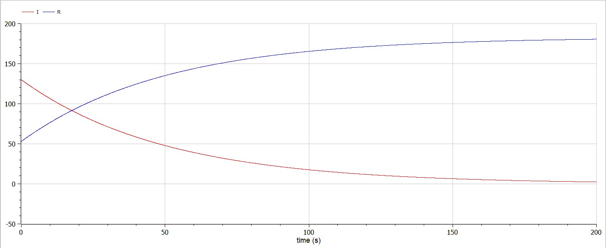
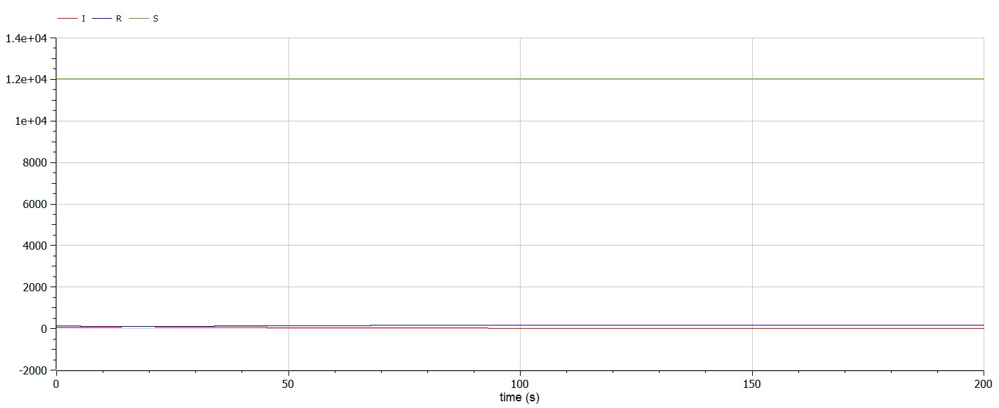
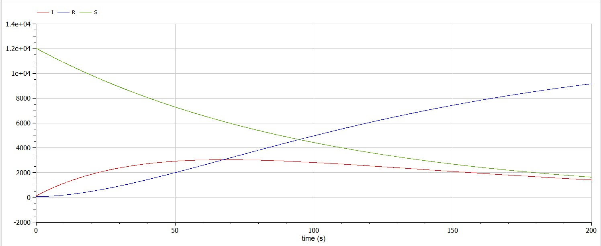

---
# Front matter
lang: ru-RU
title: Защита лабораторной работы №6. Задача об эпидемии
author: "Бармина Ольга Константиновна"
group: NFIbd-01-19
institute: RUDN University, Moscow, Russian Federation
date: 2022 March 15th

# Formatting
toc: false
slide_level: 2
header-includes: 
 - \metroset{progressbar=frametitle,sectionpage=progressbar,numbering=fraction}
 - '\makeatletter'
 - '\beamer@ignorenonframefalse'
 - '\makeatother'
aspectratio: 43
section-titles: true
theme: metropolis

---

# Результат выполнения лабораторной работы №5

# Цель выполнения лабораторной работы 

Ознакомление с простейшей моделью Эпидемии и ее построение с помощью языка программирования Modelica.

# Задачи выполнения лабораторной работы

1. Построить графики изменения числа особей в каждой из трех групп.

2. Рассмотреть, как будет протекать эпидемия в случае:

  - если $I(0) \leq I^*$

  - если $I(0) > I^*$

# Теоретические данные

Простейшая модель взаимодействия двух видов типа «хищник — жертва» основывается на следующих предположениях:

1. Численность популяции жертв x и хищников y зависят только от времени (модель не учитывает пространственное распределение популяции на занимаемой территории).

2. В отсутствии взаимодействия численность видов изменяется по модели Мальтуса, при этом число жертв увеличивается, а число хищников падает.

3. Естественная смертность жертвы и естественная рождаемость хищника считаются несущественными.

4. Эффект насыщения численности обеих популяций не учитывается.

5. Скорость роста численности жертв уменьшается пропорционально численности хищников.

# Уравнения

Скорость изменения числа S(t):

$$\frac{dS}{dt}= \begin{cases} -\alpha S &\text{,если I(t) > I*} \\
0 &\text{,если I(t) $\leq$ I*} \end{cases}$$

Cкорость изменения числа инфекционных особей:

$$\frac{dI}{dt}= \begin{cases} \alpha S -\beta I &\text{,если I(t) > I*} \\
-\beta I &\text{,если I(t) $\leq$ I*} \end{cases}$$

Cкорость изменения выздоравливающих особей:

$$\frac{dR}{dt} = \beta I$$

Для анализа картины протекания эпидемии необходимо рассмотреть два случая: $I(0) \leq I*$ и $I(0)>I*$

# Коэффициенты

Вариант 34:

На одном острове вспыхнула эпидемия. Известно, что из всех проживающих на острове $(N=12 200)$ в момент начала эпидемии $(t=0)$ число заболевших людей $(являющихся распространителями инфекции)$ I$(0)$=130, А число здоровых людей с иммунитетом к болезни R$(0)$=53. Таким образом, число людей восприимчивых к болезни, но пока здоровых, в начальный момент времени S$(0)$=N-I$(0)$- R$(0)$.

Рассмотрите, как будет протекать эпидемия в случае:

если $I(0) \leq I^*$

если $I(0) > I^*$

# Результат выполнения лабораторной работы

# Результат выполнения лабораторной работы

# Результат выполнения лабораторной работы

# Выводы

Ознакомились с простейшей моделью Эпидемии и построил графики с помощью языка программирования Modelica.