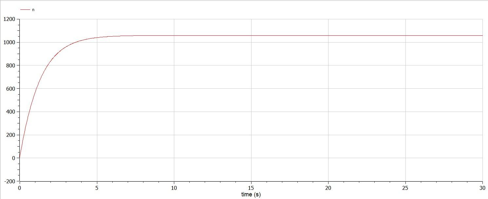

---
# Front matter
lang: ru-RU
title: Защита лабораторной работы №7. Эффективность рекламы 
author: "Бармина Ольга Константиновна"
group: NFIbd-01-19
institute: RUDN University, Moscow, Russian Federation
date: 2022 March 22th

# Formatting
toc: false
slide_level: 2
header-includes: 
 - \metroset{progressbar=frametitle,sectionpage=progressbar,numbering=fraction}
 - '\makeatletter'
 - '\beamer@ignorenonframefalse'
 - '\makeatother'
aspectratio: 43
section-titles: true
theme: metropolis

---

# Результат выполнения лабораторной работы №7

# Цель выполнения лабораторной работы 

Изучить модель эффективности рекламы.

# Задачи выполнения лабораторной работы

1. Построить график распространения рекламы о салоне красоты 

2. Сравнить эффективность рекламной кампании

3. Определить в какой момент времени эффективность рекламы будет иметь максимально быстрый рост  

4. Построить решение, если учитывать вклад только платной рекламы 

5. Построить решение, если предположить, что информация о товаре распространятся только путем «сарафанного радио», сравнить оба решения 

# Уравнения

Математическая модель распространения рекламы описывается уравнением:

$$\frac{dn}{dt} = (\alpha _1(t) + \alpha _2(t)n(t))(N-n(t))$$

# Коэффициенты

Вариант 34:

Математическая модель распространения рекламы описывается следующим уравнением:

$\frac{dn}{dt} = (0.74 + 0.000074n(t))(N-n(t))$
$\frac{dn}{dt} = (0.000074 + 0.74n(t))(N-n(t))$
$\frac{dn}{dt} = (0.74\sin (t) + 0.74tn(t))(N-n(t))$

При этом объем аудитории $N = 1060$, в начальный момент о товаре знает 7 человек.

# Результат выполнения лабораторной работы

## Результат выполнения лабораторной работы

## Результат выполнения лабораторной работы

# Выводы

Ознакомились с простейшей моделью Эпидемии и построил графики с помощью языка программирования Modelica.