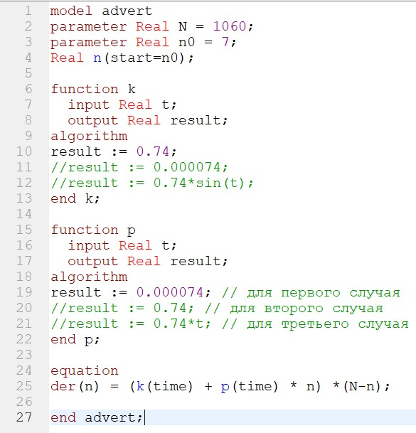
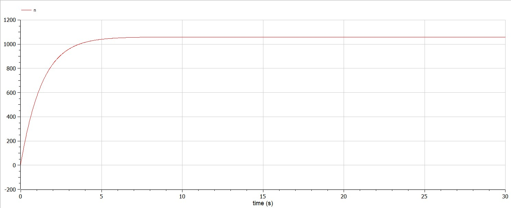
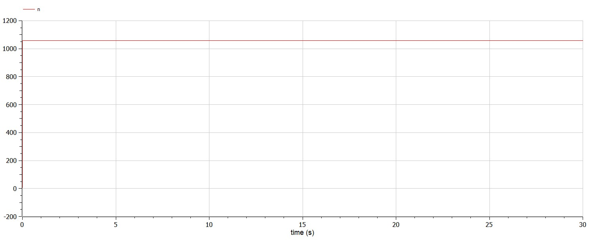
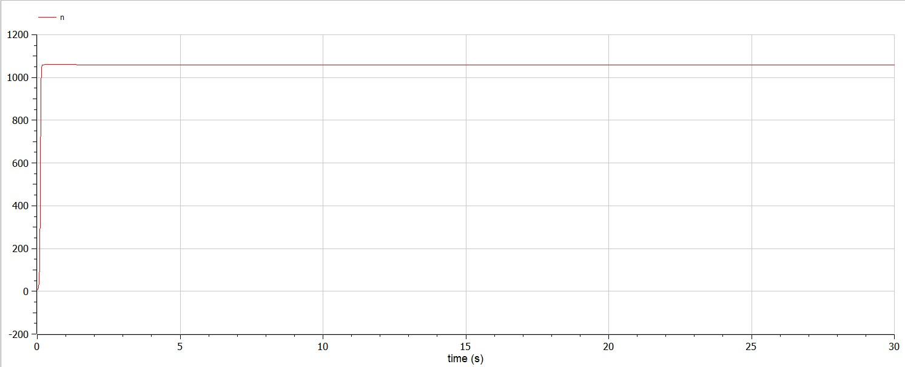
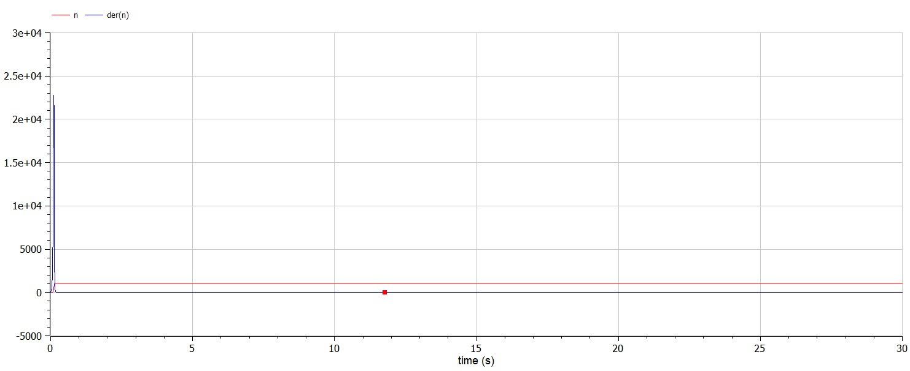

---
# Front matter
title: "Отчет по лабораторной работе №7"
subtitle: "Эффективность рекламы . Вариант 34"
author: "Бармина Ольга Константиновна"
group: NFIbd-01-19
institute: RUDN University, Moscow, Russian Federation
date: 2022 March 22th

# Generic otions
lang: ru-RU
toc-title: "Содержание"

# Pdf output format
toc: true # Table of contents
toc_depth: 2
lof: true # List of figures
lot: true # List of tables
fontsize: 12pt
linestretch: 1.5
papersize: a4
documentclass: scrreprt
### Fonts
mainfont: PT Serif
romanfont: PT Serif
sansfont: PT Sans
monofont: PT Mono
mainfontoptions: Ligatures=TeX
romanfontoptions: Ligatures=TeX
sansfontoptions: Ligatures=TeX,Scale=MatchLowercase
monofontoptions: Scale=MatchLowercase,Scale=0.9
## Biblatex
biblatex: true
biblio-style: "gost-numeric"
biblatexoptions:
  - parentracker=true
  - backend=biber
  - hyperref=auto
  - language=auto
  - autolang=other*
  - citestyle=gost-numeric
## Misc options
indent: true
header-includes:
  - \linepenalty=10 # the penalty added to the badness of each line within a paragraph (no associated penalty node) Increasing the value makes tex try to have fewer lines in the paragraph.
  - \interlinepenalty=0 # value of the penalty (node) added after each line of a paragraph.
  - \hyphenpenalty=50 # the penalty for line breaking at an automatically inserted hyphen
  - \exhyphenpenalty=50 # the penalty for line breaking at an explicit hyphen
  - \binoppenalty=700 # the penalty for breaking a line at a binary operator
  - \relpenalty=500 # the penalty for breaking a line at a relation
  - \clubpenalty=150 # extra penalty for breaking after first line of a paragraph
  - \widowpenalty=150 # extra penalty for breaking before last line of a paragraph
  - \displaywidowpenalty=50 # extra penalty for breaking before last line before a display math
  - \brokenpenalty=100 # extra penalty for page breaking after a hyphenated line
  - \predisplaypenalty=10000 # penalty for breaking before a display
  - \postdisplaypenalty=0 # penalty for breaking after a display
  - \floatingpenalty = 20000 # penalty for splitting an insertion (can only be split footnote in standard LaTeX)
  - \raggedbottom # or \flushbottom
  - \usepackage{float} # keep figures where there are in the text
  - \floatplacement{figure}{H} # keep figures where there are in the text
---

# Цель работы

Изучить модель эффективности рекламы.

# Задачи

1. Построить график распространения рекламы о салоне красоты 

2. Сравнить эффективность рекламной кампании

3. Определить в какой момент времени эффективность рекламы будет иметь максимально быстрый рост  

4. Построить решение, если учитывать вклад только платной рекламы 

5. Построить решение, если предположить, что информация о товаре распространятся только путем «сарафанного радио», сравнить оба решения 

# Теоретические сведения

Организуется рекламная кампания нового товара или услуги. Необходимо, чтобы прибыль будущих продаж с избытком покрывала издержки на рекламу. Вначале расходы могут превышать прибыль, поскольку лишь малая часть потенциальных покупателей будет информирована о новинке. Затем, при увеличении числа продаж, возрастает и прибыль, и, наконец, наступит момент, когда рынок насытиться, и рекламировать товар станет бесполезным.

Предположим, что торговыми учреждениями реализуется некоторая продукция, о которой в момент времени $t$ из числа потенциальных покупателей $N$ знает лишь $n$ покупателей. Для ускорения сбыта продукции запускается реклама по радио, телевидению и других средств массовой информации. После запуска рекламной кампании информация о продукции начнет распространяться среди потенциальных покупателей путем общения друг с другом. Таким образом, после запуска рекламных объявлений скорость изменения числа знающих о продукции людей пропорциональна как числу знающих о товаре покупателей, так и числу покупателей о нем не знающих

Модель рекламной кампании описывается следующими величинами. Считаем, что $\frac{dn}{dt}$ - скорость изменения со временем числа потребителей, узнавших о товаре и готовых его купить, $t$ - время, прошедшее с начала рекламной кампании, $N$ - общее число потенциальных платежеспособных покупателей, $n(t)$ - число уже информированных клиентов. Эта величина пропорциональна числу покупателей, еще не знающих о нем, это описывается следующим образом $\alpha _1(t)(N-n(t))$, где $\alpha _1>0$ - характеризует интенсивность рекламной кампании (зависит от затрат на рекламу в данный момент времени). Помимо этого, узнавшие о товаре потребители также распространяют полученную информацию среди потенциальных покупателей, не знающих о нем (в этом случае работает т.н. сарафанное радио). Этот вклад в рекламу описывается величиной $\alpha _2(t)n(t)(N-n(t))$. эта величина увеличивается с увеличением потребителей узнавших о товаре. [1]

Математическая модель распространения рекламы описывается уравнением:

$$\frac{dn}{dt} = (\alpha _1(t) + \alpha _2(t)n(t))(N-n(t))$$

# Начальные данные

В варианте 34 дано:

Математическая модель распространения рекламы описывается следующим уравнением:

$\frac{dn}{dt} = (0.74 + 0.000074n(t))(N-n(t))$
$\frac{dn}{dt} = (0.000074 + 0.74n(t))(N-n(t))$
$\frac{dn}{dt} = (0.74\sin (t) + 0.74tn(t))(N-n(t))$

При этом объем аудитории $N = 1060$, в начальный момент о товаре знает 7 человек.

# Ход работы

1. Напишем программу на языке Modelica.

2. Построим график по первому данному уравнению.

3. Построили график с учетом платной рекламы

4. Построили график с учетом платной рекламы и сарафанного радио

5. Также нам требуется определить, каким будет максимальное значение скорости распространения рекламы в данном случае. Скорость распространения рекламы - производная по графику распространения рекламы. Следовательно, максимальное значение будет там, где значение графика скорости максимально. По графику видно, что значение графика производной максимально в начальный момент времени t0 = 0.2

# Ответы на вопросы

1. Записать модель Мальтуса (дать пояснение, где используется данная модель)
$$ \frac{\partial N}{\partial t} = rN $$

Данная модель используется для расчета изменения популяции особей животных.

2. Записать уравнение логистической кривой (дать пояснение, что описывает данное уравнение)
$$ \frac{\partial P}{\partial t} = rP(1 - \frac{P}{K}) $$

Исходные предположения для вывода уравнения при рассмотрении популяционной динамики выглядят следующим образом:

скорость размножения популяции пропорциональна её текущей численности, при прочих равных условиях;
скорость размножения популяции пропорциональна количеству доступных ресурсов, при прочих равных условиях. Таким образом, второй член уравнения отражает конкуренцию за ресурсы, которая ограничивает рост популяции.

3. На что влияет коэффициент $\alpha_1(t)$ и $\alpha_2(t)$ в модели распространения рекламы

$\alpha_1(t)$ — интенсивность рекламной кампании, зависящая от затрат
$\alpha_2(t)$ — интенсивность рекламной кампании, зависящая от сарафанного радио

4. Как ведет себя рассматриваемая модель при $\alpha_1(t) \gg \alpha_2(t)$

см. 1 график

5. Как ведет себя рассматриваемая модель при $\alpha_1(t) \ll \alpha_2(t)$

см. 3 график

# Выводы

Изучили модель эффективности рекламы.

# Библиография

1. Методические материалы курса