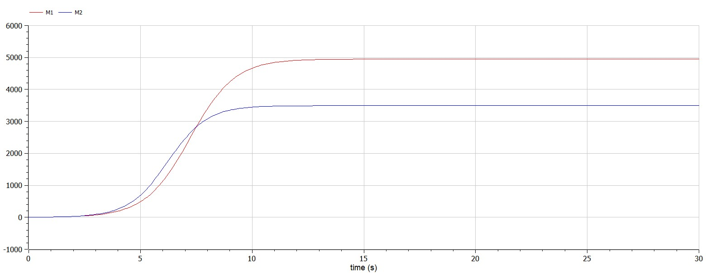
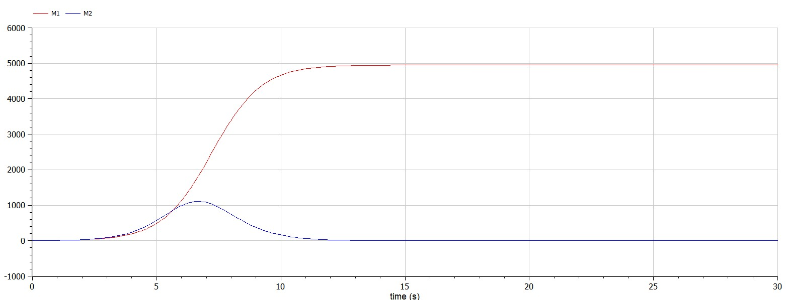

---
# Front matter
lang: ru-RU
title: Защита лабораторной работы №8. Модель конкуренции двух фирм
author: "Бармина Ольга Константиновна"
group: NFIbd-01-19
institute: RUDN University, Moscow, Russian Federation
date: 2022 March 31th

# Formatting
toc: false
slide_level: 2
header-includes: 
 - \metroset{progressbar=frametitle,sectionpage=progressbar,numbering=fraction}
 - '\makeatletter'
 - '\beamer@ignorenonframefalse'
 - '\makeatother'
aspectratio: 43
section-titles: true
theme: metropolis

---

## Цель выполнения лабораторной работы 

Ознакомление с моделью конкуренции двух фирм для двух случаев (без учета и с учетом социально-психологического фактора) и их построение с помощью языка программирования Modelica.

## Задачи выполнения лабораторной работы

1. Построить графики изменения оборотных средств фирмы 1 и фирмы 2 без учета постоянных издержек и с веденной нормировкой для случая 1 (без учета социально-психологического фактора).

2. Построить графики изменения оборотных средств фирмы 1 и фирмы 2 без учета постоянных издержек и с веденной нормировкой для случая 2 (с учетом социально-психологического фактора).

## Уравнения

Система уравнений для первого случая (без учета социально-психологического фактора):

$$ \frac{dM_1}{d\theta} = M_1 - \frac{b}{c_1} M_1 M_2 - \frac{a_1}{c_1} M_1^2 $$

$$ \frac{dM_2}{d\theta} = \frac{c_2}{c_1} M_2 - \frac{b}{c_1} M_1 M_2-\frac{a_2}{c_1} M_2^2 $$

где $$ a_1 = \frac{p_{cr}}{{\tau}1^2 p_1^2 N q }, a_2 = \frac{p{cr}}{{\tau}2^2 p_2^2 N q}, b = \frac{p{cr}}{{\tau}_1^2 p_1^2 {\tau}2^2 p_2^2 N q } $$ $$ c_1 = \frac{p{cr} - p_1}{{\tau}1 p_1}, c_2 = \frac{p{cr} - p_2}{{\tau}_2 p_2}$$

Также введена нормировка $t = c_1 \theta$.

## Уравнения

Система уравнений для второго случая (с учетом социально-психологического фактора) принимает следующий вид:

$$ \frac{dM_1}{d\theta} = M_1 - \frac{b}{c_1} M_1 M_2-\frac{a_1}{c_1} M_1^2 $$

$$ \frac{dM_2}{d\theta} = \frac{c_2}{c_1} M_2 - (\frac{b}{c_1} + 0.00083) M_1 M_2-\frac{a_2}{c_1} M_2^2 $$

## Коэффициенты

Вариант 34:

$$ M_0^1 = 3.6, M_0^2 = 2.9, p_cr = 32, N = 33, q = 1, \tau_1 = 25, \tau_2 = 15, p_1 = 8, p_2 = 10.5$$

N - число потребителей производимого продукта, $\tau$ - длительность производственного цикла, pcr - критическая стоимость продукта, p - себестоимость продукта, q - максимальная потребность одного человека в продукте в единицу времени, $\theta=\frac{t}{c_1}$ - безразмерное время.

## Результат выполнения лабораторной работы

## Результат выполнения лабораторной работы

# Выводы

Ознакомилась с моделью конкуренции двух фирм для двух случаев (без учета и с учетом социально-психологического фактора). Построила соответствующие графики.