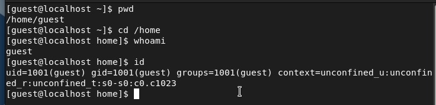
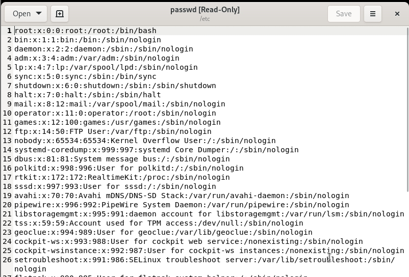
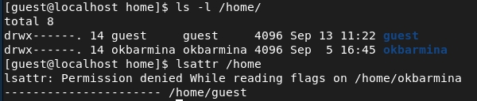
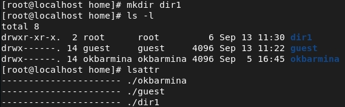
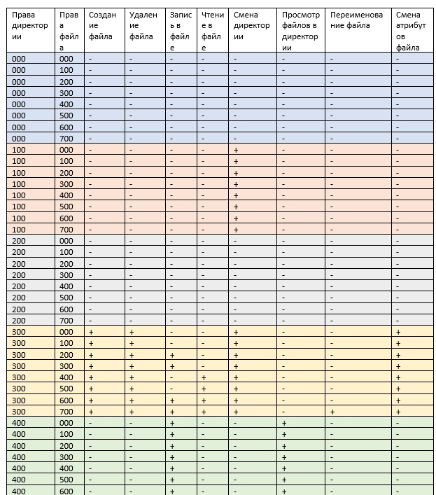
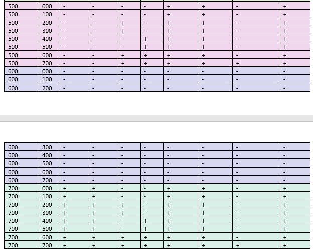

---
# Front matter
lang: ru-RU
title: Защита лабораторной работы №2. Дискреционное разграничение прав в Linux. Основные атрибуты
author: "Бармина Ольга Константиновна"
group: NFIbd-01-19
institute: RUDN University, Moscow, Russian Federation
date: 2022 Sep 13th

# Formatting
toc: false
slide_level: 2
header-includes: 
 - \metroset{progressbar=frametitle,sectionpage=progressbar,numbering=fraction}
 - '\makeatletter'
 - '\beamer@ignorenonframefalse'
 - '\makeatother'
aspectratio: 43
section-titles: true
theme: metropolis

---

# Результат выполнения лабораторной работы №2

## Цель выполнения лабораторной работы 

Получение практических навыков работы в консоли с атрибутами файлов, закрепление теоретических основ дискреционного разграничения доступа в современных системах с открытым кодом на базе ОС Linux.

## Результат выполнения лабораторной работы

## Результат выполнения лабораторной работы

## Результат выполнения лабораторной работы

## Результат выполнения лабораторной работы

## Результат выполнения лабораторной работы

## Результат выполнения лабораторной работы

## Результат выполнения лабораторной работы

## Результат выполнения лабораторной работы

## Вывод 

В ходе работы мы получили практические навыки работы в консоли с атрибутами файлов, закрепили теоретические основы дискреционного разграничения доступа в современных системах с открытым кодом на базе ОС Linux.