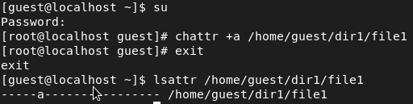

---
# Front matter
title: "Отчет по лабораторной работе №4"
subtitle: "Дискреционное разграничение прав в Linux. Расширенные атрибуты"
author: "Бармина Ольга Константиновна"
group: NFIbd-01-19
institute: RUDN University, Moscow, Russian Federation
date: 2022 Sep 21th

# Generic otions
lang: ru-RU
toc-title: "Содержание"

# Bibliography
bibliography: bib/cite.bib
csl: pandoc/csl/gost-r-7-0-5-2008-numeric.csl

# Pdf output format
toc: true # Table of contents
toc_depth: 2
lof: true # List of figures
lot: true # List of tables
fontsize: 12pt
linestretch: 1.5
papersize: a4
documentclass: scrreprt
### Fonts
mainfont: PT Serif
romanfont: PT Serif
sansfont: PT Sans
monofont: PT Mono
mainfontoptions: Ligatures=TeX
romanfontoptions: Ligatures=TeX
sansfontoptions: Ligatures=TeX,Scale=MatchLowercase
monofontoptions: Scale=MatchLowercase,Scale=0.9
## Biblatex
biblatex: true
biblio-style: "gost-numeric"
biblatexoptions:
  - parentracker=true
  - backend=biber
  - hyperref=auto
  - language=auto
  - autolang=other*
  - citestyle=gost-numeric
## Misc options
indent: true
header-includes:
  - \linepenalty=10 # the penalty added to the badness of each line within a paragraph (no associated penalty node) Increasing the value makes tex try to have fewer lines in the paragraph.
  - \interlinepenalty=0 # value of the penalty (node) added after each line of a paragraph.
  - \hyphenpenalty=50 # the penalty for line breaking at an automatically inserted hyphen
  - \exhyphenpenalty=50 # the penalty for line breaking at an explicit hyphen
  - \binoppenalty=700 # the penalty for breaking a line at a binary operator
  - \relpenalty=500 # the penalty for breaking a line at a relation
  - \clubpenalty=150 # extra penalty for breaking after first line of a paragraph
  - \widowpenalty=150 # extra penalty for breaking before last line of a paragraph
  - \displaywidowpenalty=50 # extra penalty for breaking before last line before a display math
  - \brokenpenalty=100 # extra penalty for page breaking after a hyphenated line
  - \predisplaypenalty=10000 # penalty for breaking before a display
  - \postdisplaypenalty=0 # penalty for breaking after a display
  - \floatingpenalty = 20000 # penalty for splitting an insertion (can only be split footnote in standard LaTeX)
  - \raggedbottom # or \flushbottom
  - \usepackage{float} # keep figures where there are in the text
  - \floatplacement{figure}{H} # keep figures where there are in the text
---

# Цель работы

Целью данной работы является получение практических навыков работы в консоли с расширенными атрибутами файлов. [1]

# Выполнение лабораторной работы

1. От имени пользователя guest определила расширенные атрибуты файла /home/guest/dir1/file1. Установила на файл file1 права, разрешающие чтение и запись для владельца файла. Попробовала установить на файл /home/guest/dir1/file1 расширенный атрибут a от имени пользователя guest.

2. Повысила свои права с помощью команды su. Установила расширенный атрибут a на файл /home/guest/dir1/file1 от имени суперпользователя. От пользователя guest проверила правильность установления атрибута.

3. Выполнила дозапись в файл file1 слова «test», затем прочитала этот файл. Попробовала переименовать и удалить файл file1. С помощью команды chmod 000 file1 установила на файл file1 права и попробовала выполнить те же команды.

4. Сняла расширенный атрибут a с файла /home/guest/dirl/file1 от имени суперпользователя. Повторила операции, которые ранее не удавалось выполнить. 

5. Заменила атрибут «a» атрибутом «i». Повторила те же команды.

# Выводы

В ходе работы мы получили практические навыки работы в консоли с расширенными атрибутами файлов.

# Список литературы

1. Методические материалы курса