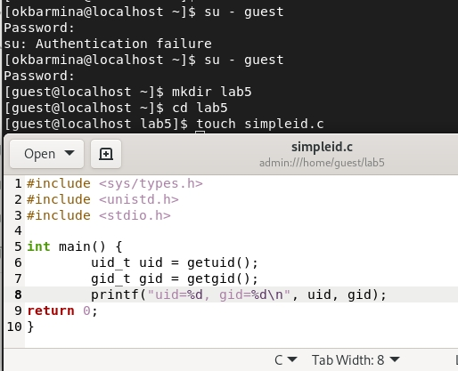
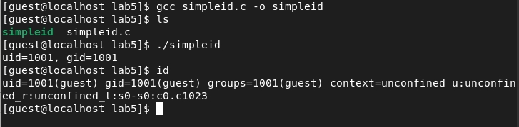
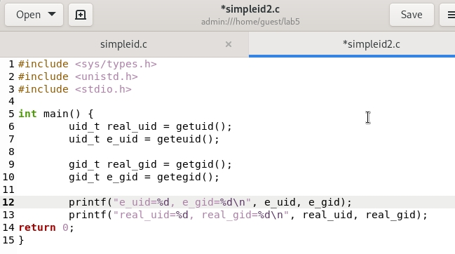
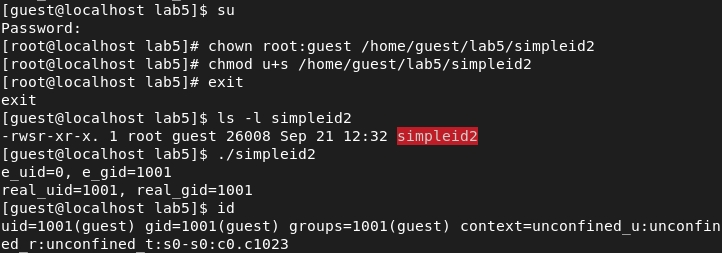
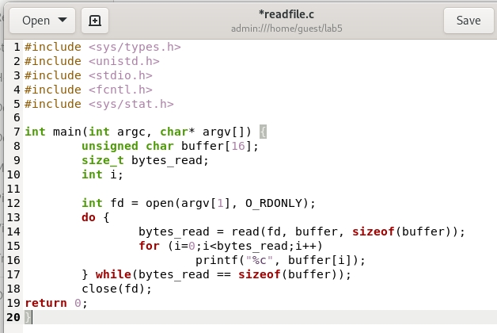
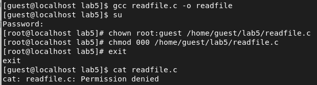
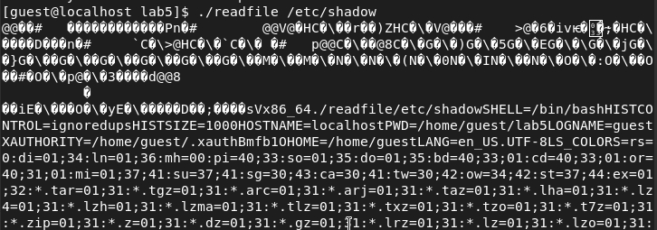
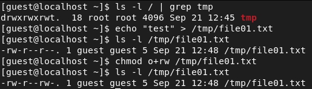
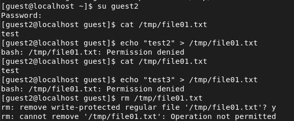
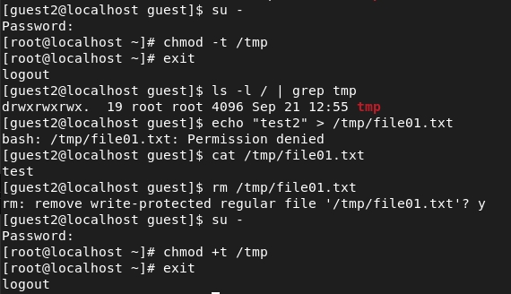

---
# Front matter
lang: ru-RU
title: Защита лабораторной работы №5. Дискреционное разграничение прав в Linux. Исследование влияния дополнительных атрибутов
author: "Бармина Ольга Константиновна"
group: NFIbd-01-19
institute: RUDN University, Moscow, Russian Federation
date: 2022 Sep 21th

# Formatting
toc: false
slide_level: 2
header-includes: 
 - \metroset{progressbar=frametitle,sectionpage=progressbar,numbering=fraction}
 - '\makeatletter'
 - '\beamer@ignorenonframefalse'
 - '\makeatother'
aspectratio: 43
section-titles: true
theme: metropolis

---

# Результат выполнения лабораторной работы №5

## Цель выполнения лабораторной работы 

Изучение механизмов изменения идентификаторов, применения SetUID- и Sticky-битов. Получение практических навыков работы в консоли с дополнительными атрибутами. Рассмотрение работы механизма смены идентификатора процессов пользователей, а также влияние бита Sticky на запись и удаление файлов.

## Результат выполнения лабораторной работы

## Результат выполнения лабораторной работы

## Результат выполнения лабораторной работы

## Результат выполнения лабораторной работы

## Результат выполнения лабораторной работы

## Результат выполнения лабораторной работы

## Результат выполнения лабораторной работы

## Результат выполнения лабораторной работы

## Результат выполнения лабораторной работы

## Результат выполнения лабораторной работы

## Результат выполнения лабораторной работы

## Вывод 

В ходе работы мы изучили механизмы изменения идентификаторов, применения SetUID- и Sticky-битов. Получили практические навыки работы в консоли с дополнительными атрибутами. Рассмотрели работы механизма смены идентификатора процессов пользователей, а также влияние бита Sticky на запись и удаление файлов.