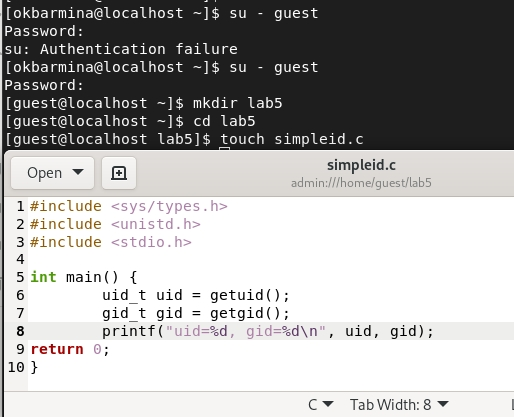
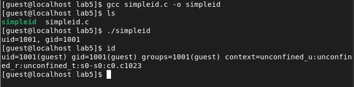
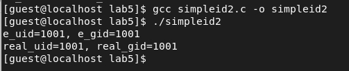
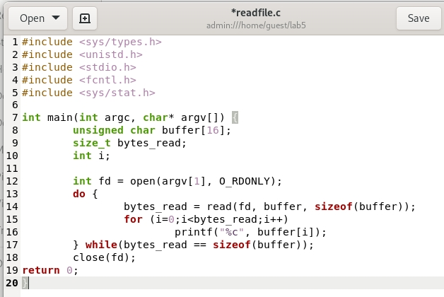
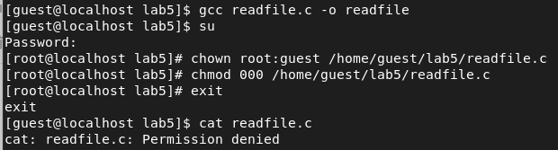

---
# Front matter
title: "Отчет по лабораторной работе №5"
subtitle: "Дискреционное разграничение прав в Linux. Исследование влияния дополнительных атрибутов"
author: "Бармина Ольга Константиновна"
group: NFIbd-01-19
institute: RUDN University, Moscow, Russian Federation
date: 2022 Sep 21th

# Generic otions
lang: ru-RU
toc-title: "Содержание"

# Bibliography
bibliography: bib/cite.bib
csl: pandoc/csl/gost-r-7-0-5-2008-numeric.csl

# Pdf output format
toc: true # Table of contents
toc_depth: 2
lof: true # List of figures
lot: true # List of tables
fontsize: 12pt
linestretch: 1.5
papersize: a4
documentclass: scrreprt
### Fonts
mainfont: PT Serif
romanfont: PT Serif
sansfont: PT Sans
monofont: PT Mono
mainfontoptions: Ligatures=TeX
romanfontoptions: Ligatures=TeX
sansfontoptions: Ligatures=TeX,Scale=MatchLowercase
monofontoptions: Scale=MatchLowercase,Scale=0.9
## Biblatex
biblatex: true
biblio-style: "gost-numeric"
biblatexoptions:
  - parentracker=true
  - backend=biber
  - hyperref=auto
  - language=auto
  - autolang=other*
  - citestyle=gost-numeric
## Misc options
indent: true
header-includes:
  - \linepenalty=10 # the penalty added to the badness of each line within a paragraph (no associated penalty node) Increasing the value makes tex try to have fewer lines in the paragraph.
  - \interlinepenalty=0 # value of the penalty (node) added after each line of a paragraph.
  - \hyphenpenalty=50 # the penalty for line breaking at an automatically inserted hyphen
  - \exhyphenpenalty=50 # the penalty for line breaking at an explicit hyphen
  - \binoppenalty=700 # the penalty for breaking a line at a binary operator
  - \relpenalty=500 # the penalty for breaking a line at a relation
  - \clubpenalty=150 # extra penalty for breaking after first line of a paragraph
  - \widowpenalty=150 # extra penalty for breaking before last line of a paragraph
  - \displaywidowpenalty=50 # extra penalty for breaking before last line before a display math
  - \brokenpenalty=100 # extra penalty for page breaking after a hyphenated line
  - \predisplaypenalty=10000 # penalty for breaking before a display
  - \postdisplaypenalty=0 # penalty for breaking after a display
  - \floatingpenalty = 20000 # penalty for splitting an insertion (can only be split footnote in standard LaTeX)
  - \raggedbottom # or \flushbottom
  - \usepackage{float} # keep figures where there are in the text
  - \floatplacement{figure}{H} # keep figures where there are in the text
---

# Цель работы

Целью данной работы является изучение механизмов изменения идентификаторов, применения SetUID- и Sticky-битов. Получение практических навыков работы в консоли с дополнительными атрибутами. Рассмотрение работы механизма смены идентификатора процессов пользователей, а также влияние бита Sticky на запись и удаление файлов. [1]

# Выполнение лабораторной работы

1. Вошла в систему от имени пользователя guest. Создала программу simpleid.c

2. Скомплировала программу и убедилась, что файл программы создан. Выполнила программу. Для сравнения выполнила системную программу id.

3. Усложнила программу, добавив вывод действительных идентификаторов.

4. Скомпилировала и запустила simpleid2.c

5. От имени суперпользователя выполните команды chown root:guest /home/guest/simpleid2 и chmod u+s /home/guest/simpleid2. Выполнила проверку правильности установки новых атрибутов и смены владельца файла simpleid2. Запустила simpleid2 и id.

6. Создала программу readfile.c

7. Откомпилировала её. Сменила владельца у файла readfile.c и изменила права так, чтобы только суперпользователь мог прочитать его, a guest не мог. 

8. Сменила у программы readfile владельца и установила SetU’D-бит. Проверила, может ли программа readfile прочитать файл readfile.c, Проверила, может ли программа readfile прочитать файл /etc/shadow.

9. Выяснила, установлен ли атрибут Sticky на директории /tmp. От имени пользователя guest создала файл file01.txt в директории /tmp со словом test. Просмотрела атрибуты у только что созданного файла и разрешила чтение и запись для категории пользователей «все остальные».

10. От пользователя guest2 попробовала прочитать файл, дозаписать в файл слово test2. Проверила содержимое файла. Попробовала записать в файл слово test3, стерев при этом всю имеющуюся в файле информацию. Проверила содержимое файла. Попробовала удалить файл.

11. Повысила свои права до суперпользователя и выполнила команду, снимающую атрибут t с директории /tmp. Покинула режим суперпользователя. От пользователя guest2 проверила, что атрибута t у директории /tmp нет. Попробовала прочитать файл, дозаписать в файл, удалить его. Повысила свои права до суперпользователя и вернула атрибут t на директорию /tmp.

# Выводы

В ходе работы мы изучили механизмы изменения идентификаторов, применения SetUID- и Sticky-битов. Получили практические навыки работы в консоли с дополнительными атрибутами. Рассмотрели работы механизма смены идентификатора процессов пользователей, а также влияние бита Sticky на запись и удаление файлов.

# Список литературы

1. Методические материалы курса