---
# Front matter
title: "Отчет по лабораторной работе №6"
subtitle: "Мандатное разграничение прав в Linux"
author: "Бармина Ольга Константиновна"
group: NFIbd-01-19
institute: RUDN University, Moscow, Russian Federation
date: 2022 Sep 22th

# Generic otions
lang: ru-RU
toc-title: "Содержание"

# Bibliography
bibliography: bib/cite.bib
csl: pandoc/csl/gost-r-7-0-5-2008-numeric.csl

# Pdf output format
toc: true # Table of contents
toc_depth: 2
lof: true # List of figures
lot: true # List of tables
fontsize: 12pt
linestretch: 1.5
papersize: a4
documentclass: scrreprt
### Fonts
mainfont: PT Serif
romanfont: PT Serif
sansfont: PT Sans
monofont: PT Mono
mainfontoptions: Ligatures=TeX
romanfontoptions: Ligatures=TeX
sansfontoptions: Ligatures=TeX,Scale=MatchLowercase
monofontoptions: Scale=MatchLowercase,Scale=0.9
## Biblatex
biblatex: true
biblio-style: "gost-numeric"
biblatexoptions:
  - parentracker=true
  - backend=biber
  - hyperref=auto
  - language=auto
  - autolang=other*
  - citestyle=gost-numeric
## Misc options
indent: true
header-includes:
  - \linepenalty=10 # the penalty added to the badness of each line within a paragraph (no associated penalty node) Increasing the value makes tex try to have fewer lines in the paragraph.
  - \interlinepenalty=0 # value of the penalty (node) added after each line of a paragraph.
  - \hyphenpenalty=50 # the penalty for line breaking at an automatically inserted hyphen
  - \exhyphenpenalty=50 # the penalty for line breaking at an explicit hyphen
  - \binoppenalty=700 # the penalty for breaking a line at a binary operator
  - \relpenalty=500 # the penalty for breaking a line at a relation
  - \clubpenalty=150 # extra penalty for breaking after first line of a paragraph
  - \widowpenalty=150 # extra penalty for breaking before last line of a paragraph
  - \displaywidowpenalty=50 # extra penalty for breaking before last line before a display math
  - \brokenpenalty=100 # extra penalty for page breaking after a hyphenated line
  - \predisplaypenalty=10000 # penalty for breaking before a display
  - \postdisplaypenalty=0 # penalty for breaking after a display
  - \floatingpenalty = 20000 # penalty for splitting an insertion (can only be split footnote in standard LaTeX)
  - \raggedbottom # or \flushbottom
  - \usepackage{float} # keep figures where there are in the text
  - \floatplacement{figure}{H} # keep figures where there are in the text
---

# Цель работы

Целью данной работы является развитие навыки администрирования ОС Linux, получение первого практического знакомства с технологией SELinux1, проверка работы SELinx на практике совместно с веб-сервером Apache.[1]

# Выполнение лабораторной работы

1. Вошла в систему с полученными учётными данными и убедилась, что
SELinux работает в режиме enforcing политики targeted.

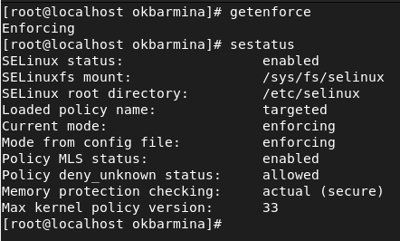

2. Обратилась с помощью браузера к веб-серверу, и убедилась, что он работает. Нашла веб-сервер Apache в списке процессов, определила его контекст безопасности. Посмотрела текущее состояние переключателей SELinux для Apache.

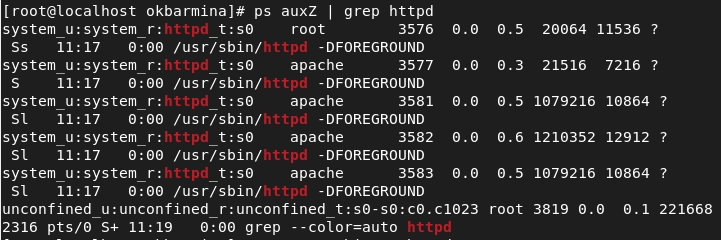

3. Посмотрела статистику по политике, также определила множество пользователей, ролей, типов.

4. Определила тип файлов и поддиректорий, находящихся в директории /var/www. Определила тип файлов, находящихся в директории /var/www/html. Определила круг пользователей, которым разрешено создание файлов в директории /var/www/html.

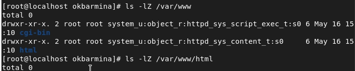

5.  Создала от имени суперпользователя html-файл. Проверила контекст созданного файла. Обратилась к файлу через веб-сервер. Убедилась, что файл был успешно отображён.

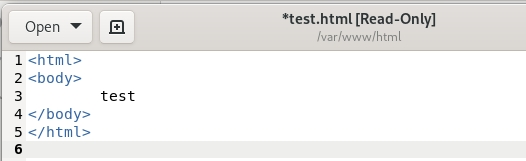

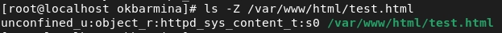

6. Изменила контекст файла /var/www/html/test.html на samba_share_t.

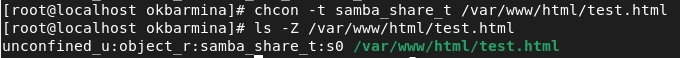

7. Попробовала ещё раз получить доступ к файлу через веб-сервер.

8. Просмотрела log-файлы веб-сервера Apache и системный лог-файл. 

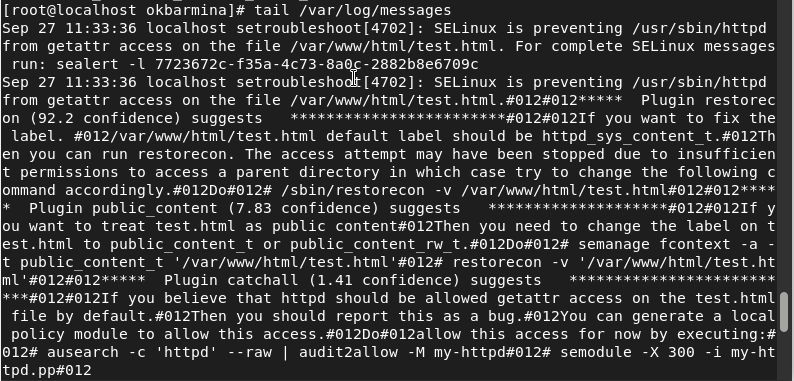

9. Попробовала запустить веб-сервер Apache на прослушивание ТСР-порта 81. Выполнила перезапуск веб-сервера Apache.

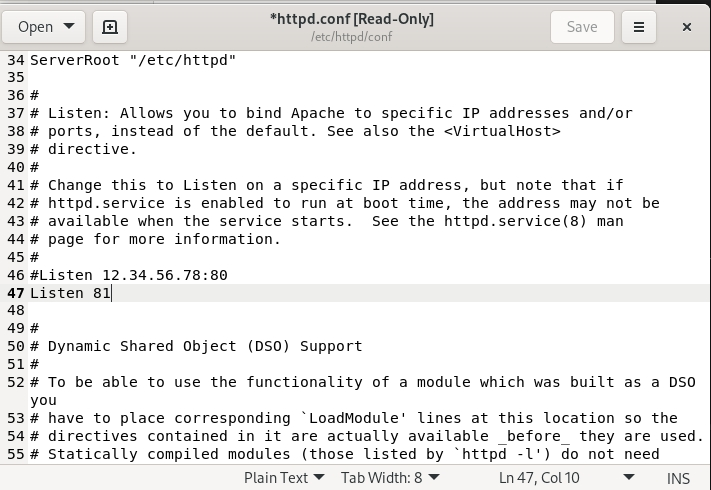

10. Просмотрела log-файлы веб-сервера Apache.

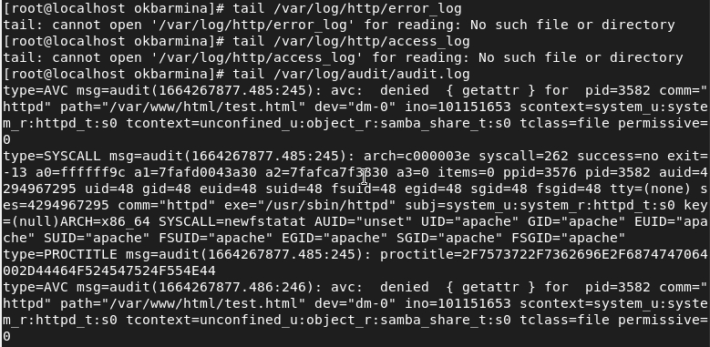

11. Выполнила команду semanage port -a -t http_port_t -р tcp 81. Попробовала запустить веб-сервер Apache ещё раз.

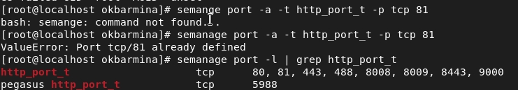

12. Вернула контекст httpd_sys_cоntent__t к файлу /var/www/html/ test.html. Исправила обратно конфигурационный файл apache, удалила привязку http_port_t к 81 порту, удалила файл /var/www/html/test.html.

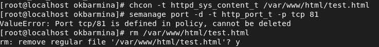

# Выводы

В ходе работы мы развили навыки администрирования ОС Linux, получили первое практическое знакомство с технологией SELinux1, проверили работу SELinx на практике совместно с веб-сервером Apache.

# Список литературы

1. Методические материалы курса